# KS0441 Desktop Mini Bluetooth Smart Car V3.0

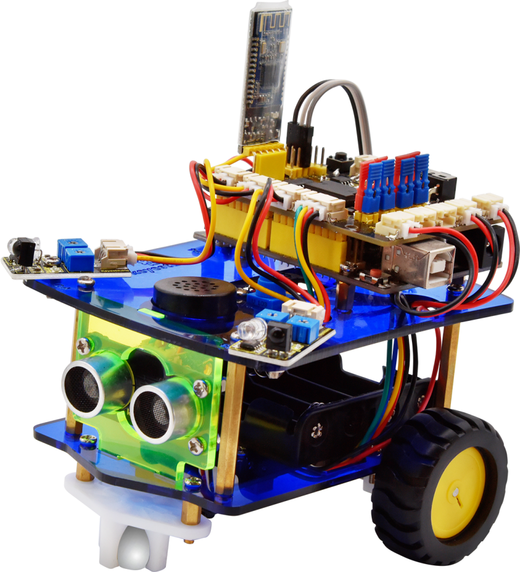

## Read me frist

 **Download the APP, Code and library from the link: <https://fs.keyestudio.com/KS0441>**

## Description

We can often see others on the internet making use of control boards and electrical components to build their own creative robots. Wanna DIY your own robot?

Here comes keyestudio desktop mini Bluetooth smart car V3.0, which is an upgraded version of keyestudio desktop mini Bluetooth smart car V2.0.

The smart car still keeps the functions like line tracking, obstacle avoidance, IR and Bluetooth control and more.

Furthermore, we make a great improvement for the smart car as follows:

1.  The Acrylic plates are more bright and colorful;

2.  Adding a microphone sound module to make a fantastic sound when driving the car running;
    
3.  Using Bluetooth HM-10 module,which can support Bluetooth 4.0; supporting both Android and iOS system; also can actuate the smart car with our own designed Bluetooth APP.
    
4.  Can freely choose the battery case 18650 or 4-cell AA battery case to supply power for the robot car. Note that batteries are Not Included. Users can freely choose two 18650 batteries or four AA batteries (1.5V) to supply power for the robot car.
    
5.  Making improvements on the motor drive board; one is coming with a slide switch for controlling the power switch;the other is adding 8 jumper caps to control the DC motor direction by hand,easy for code debugging.
    
6.  Coding the robot car with Mixly blocks software, more simple and ready to play.

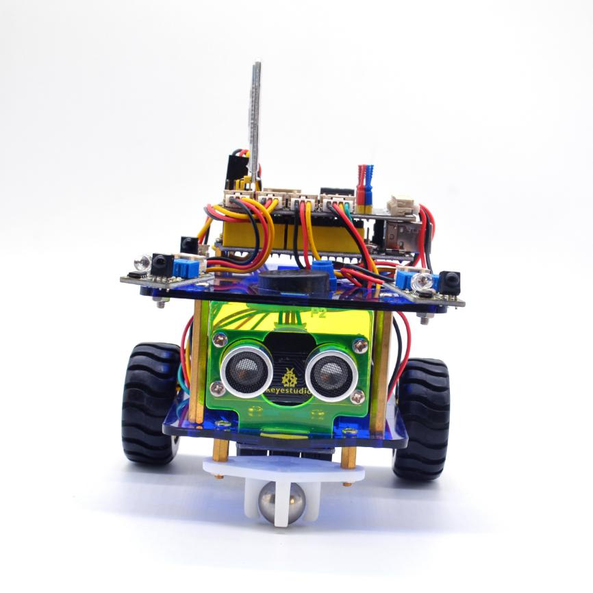

From the basics up to complex projects, through this kit you can learn to control the robot car with **Mixly blocks coding**. Easy to code and learn coding and computational thinking.

If you are looking for inspiration, you can find a great variety of tutorials here. Take your brain on a fun and inspiring journey through the world of programming and electronics.

## Parameters

1.  Motor Voltage range: 1-6V; motor shaft length: 10mm; speed: 6.0V 100rpm/min.

2.  Motor control is driven by L298P;

3.  Three groups of line tracking modules, to detect black-white line with higher accuracy and can also be used for anti-fall control;
    
4.  Two groups of obstacle detector modules, to detect whether there are obstacles on the left or right side of smart car; Ultrasonic module is used to detect the distance between ultrasonic and obstacles, forming the smart car’s obstacle avoidance system;
    
5.  Bluetooth wireless module can be paired with Bluetooth device on mobile phone to remotely control smart car;
    
6.  Infrared receiver module is matched with an infrared remote control to control the smart car;
    
7.  Can access the external 7 \~ 12V voltage.

## Component List

When get this smart car kit, at first glance, you will see the beautiful packaging box. And each component is safely packed inside the small bag in order. You will get such a bulk of components and screws to make your own smart car. So we have listed all the components as follows:

|                        **Components**                        | **Quantity** |                         **Picture**                          |
| :----------------------------------------------------------: | :----------: | :----------------------------------------------------------: |
|                 Keyestudio UNO R3 Main Board                 |      1       |                     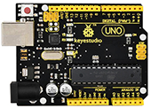                      |
|      Keyestudio quick connectors motor driver shield V2      |      1       |                     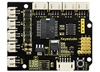                      |
|        Keyestudio quick connectors IR receiver module        |      1       |                     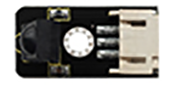                      |
|       Keyestudio quick connectors line tracking sensor       |      1       |                     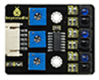                      |
|     Keyestudio quick connectors obstacle detector module     |      2       |                     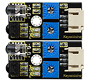                      |
|        Keyestudio quick connectors ultrasonic module         |      1       |                     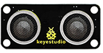                      |
|              keyestudio HM-10 Bluetooth -4.0 V3              |      1       |           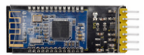           |
|            Keyestudio Power Amplification Module             |      1       |      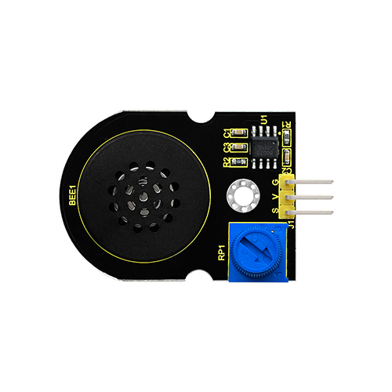       |
|     Keyestudio quick connectors 12FN20 motor A connector     |      1       |       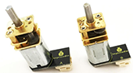       |
|     Keyestudio quick connectors 12FN20 motor B connector     |      1       |                                                              |
| Keyestudio JMFP-4 17-button 86\*40\*6.5MM yellow (eco-friendly) (no battery) |      1       |          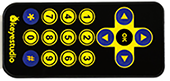          |
| Double-Connector JST-PH2.0MM-5P 24AWG blue-green-yellow-red-black wire 15CM (reverse direction) |      1       |                                         |
| Double-Connector JST-PH2.0MM-4P 24AWG green-yellow-red-black wire 8CM (reverse direction) |      1       |                                         |
| Double-Connector JST-PH2.0MM-3P 24AWG yellow-red-black wire 8CM  (reverse direction) |      3       |                    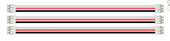                     |
|  Double-Connector JST-PH2.0MM-2P 24AWG red-black wire 160mm  |      2       |                                         |
| 18650 Battery holder with JST-PH2.0MM-2P socket lead, black-red lead length 115mm |      1       |                     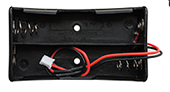                      |
|      4-cell AA battery case +JST-PH2.0MM-2P 150mm lead       |      1       |      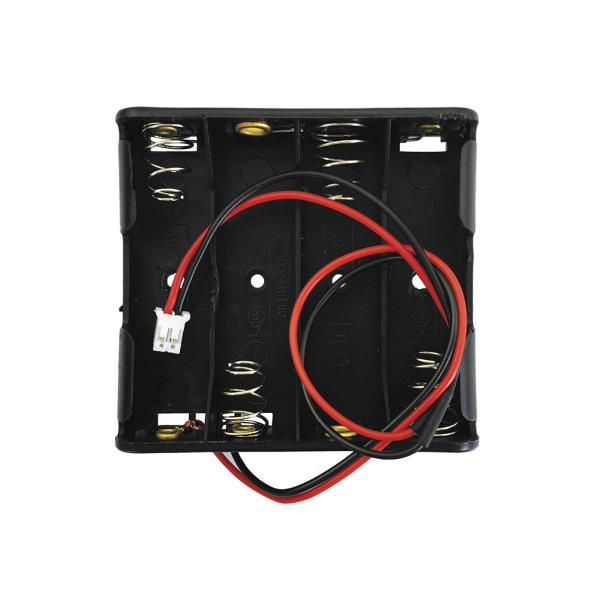       |
|                  Screw M2\*10MM round head                   |      6       |                    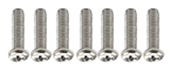                     |
|                    M2 nickle plating Nut                     |      6       |                        |
|               Screw M3\*10MM round cross head                |      12      |                    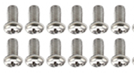                     |
|                   Screw M3\*6MM round head                   |      18      |                    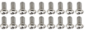                     |
|                   Screw M3\*8MM flat head                    |      4       |                    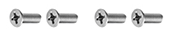                     |
|                    M3 nickle plating Nut                     |      20      |                                         |
|               Dual-pass M3\*40MM Copper Pillar               |      4       |                                         |
|                    Single-pass M3\*8+6MM                     |      6       |                    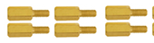                     |
|                    Single-pass M3\*5+6MM                     |      2       |                    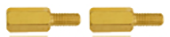                     |
| ABS Plastic +rubber Wheel  Diameter: 43mm; Width: 9mm ; Aperture: 3mm D-type hole |      2       |                    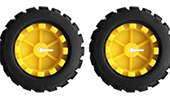                     |
|            white U-type plastic N20 motor holder             |      2       |                    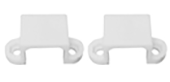                     |
|       Acrylic panel (3PCS) eco-friendly thickness 3MM        |      1       |                                         |
|        Black-yellow Handle 3\*40MM cross screwdriver         |      1       |                                         |
|         USB cable AM/BM transparent blue OD:5.0 L=1m         |      1       |                     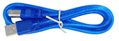                      |
| W420 Ball Caster Wheel  (Ball Diameter 15MM; Holder Material: Nylon) |      1       | 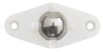 |
|                 keyestudio White LED Module                  |      1       | 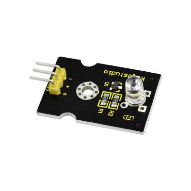 |
|      3Pin female header jumper wire length 20CM 2.54mm       |      1       |     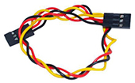      |
|                    100mm Nylon cable ties                    |      6       |       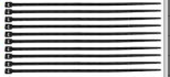        |

## Software Introduction

Installing Arduino IDE

When program the UNO R3 development board, you can download the Arduino integrated development environment from the link: [https://www.arduino.cc/en/Main/OldSoftwareReleases\#1.5.x](https://www.arduino.cc/en/Main/OldSoftwareReleases#1.5.x)

See more contents at: <https://wiki.keyestudio.com/How_to_Download_Arduino_IDE>

<https://wiki.keyestudio.com/Getting_Started_with_Arduino>

Or you can browse the KEYESTUDIO WIKI website at this link  <https://www.keyestudio.com/>

Introduction for Mixly Blocks

Mixly is a free open-source graphical Arduino programming software, based on Google’s Blockly graphical programming framework, and developed by Mixly Team@BNU.

It is a free open-source graphical programming tool for creative electronic development; a complete support ecosystem for creative e-education; a stage for maker educators to realize their dreams.

More info please check the link to download the Mixly blocks software.

-   <https://wiki.keyestudio.com/Getting_Started_with_Mixly>

-   <https://wiki.keyestudio.com/Download_Mixly_Software>

-   <https://wiki.keyestudio.com/How_to_Import_Mixly_Library>

Before starting the below projects, please click the link to get the basic understanding of Mixly software.

Importing Robot Library

For the robot kit, we have developed keyestudio robot car library. Don’t forget to import the keyestudio desktop car library to Mixly software before coding the robot projects.

Must import the robot car library first, or else you can’t check all the test code.

Unzip the desktop_car library package, you can see the **desktop_car XML.document**.

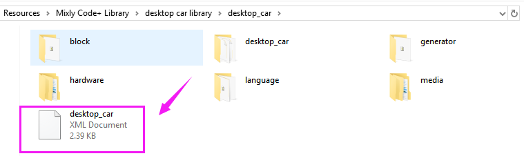

Then import this document into Mixly library. Import custom library successfully!

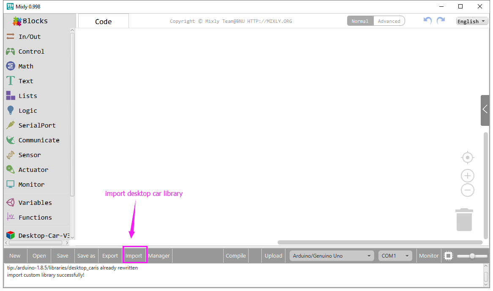

You are able to click “Manager” to manage all imported libraries. Note: sometimes it may exists a conflict between libraries, so should keep only correct car library when using and delete other library.

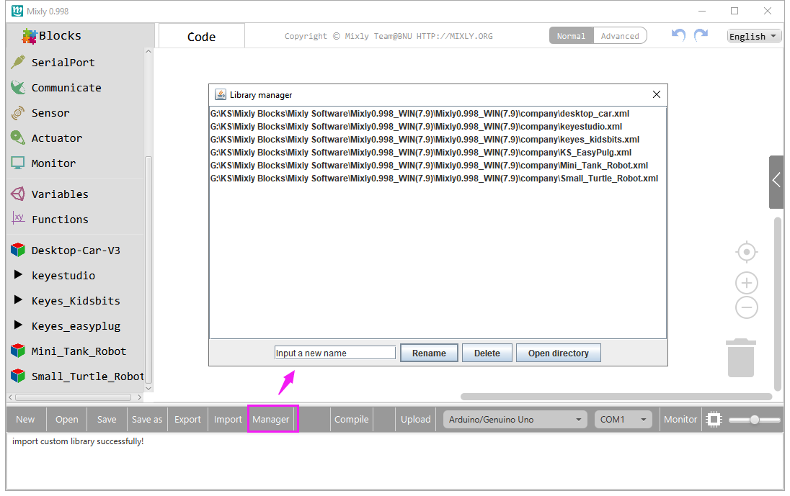

## Basic Projects

### Project 1: UNO R3 Built-in LED

Introduction

The UNO R3 development board is the most popular one in Arduino board series. In addition, it is also the best choice for beginners to learn to build electronic circuits and write the source code.

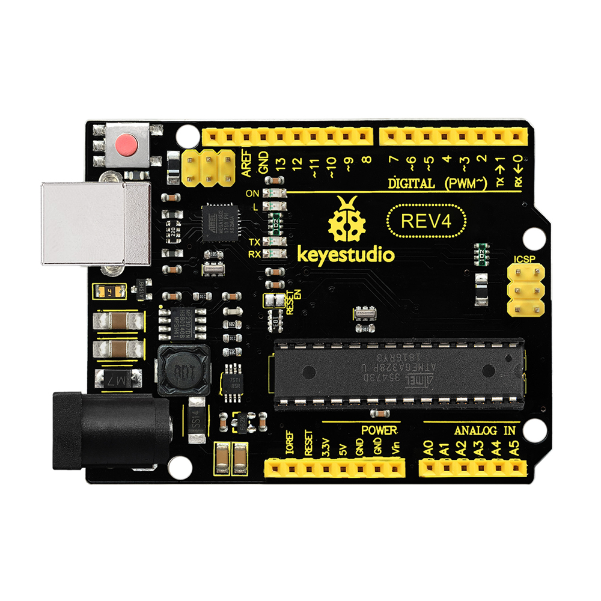

If this is your first experience tinkering with the platform, the UNO R3 is the most robust board you can start playing with.

Let's take a look at the details of this development board with the following chart:

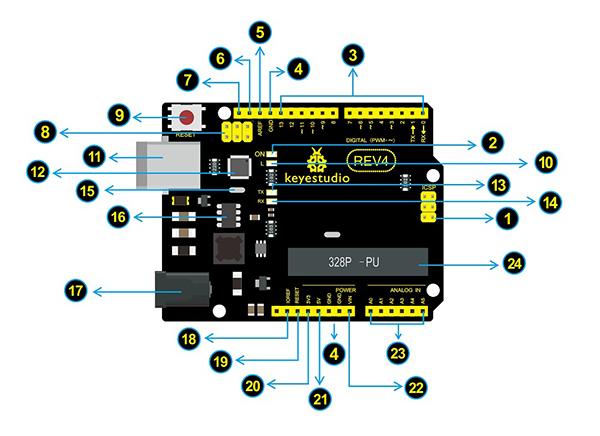

|                     NUMBER                      |                       PIN                       | FUNCTION                                                     |
| :---------------------------------------------: | :---------------------------------------------: | ------------------------------------------------------------ |
|  | **ICSP (In-Circuit Serial Programming) Header** | In most case, ICSP is the AVR, an Arduino micro-program header consisting of MOSI, MISO, SCK, RESET, VCC, and GND.  It is often called the SPI (serial peripheral interface) and can be considered an "extension" of the output.  In fact, slave the output devices under the SPI bus host.  When connecting to PC, program the firmware to ATMEGA328P-PU. |
|  |             **Power LED Indicator**             | Powering the Arduino, LED on means that your circuit board is correctly powered on.  If LED is off, connection is wrong. |
|  |                 **Digital I/O**                 | Keyestudio UNO R3 (Black) Main Control Board has 14 digital input/output pins (of which 6 can be used as PWM outputs).  These pins can be configured as digital input pin to read the logic value (0 or 1).  Or used as digital output pin to drive different modules like LED, relay, etc.  The pin labeled “〜” can be used to generate PWM. |
|  |          **GND ( Ground pin headers)**          | Used for circuit ground                                      |
|  |                    **AREF**                     | Reference voltage (0-5V) for analog inputs. Used with analogReference() |
|  |                    **SDA** I                    | IC communication pin                                         |
|  |                     **SCL**                     | IIC communication pin                                        |
|  | **ICSP (In-Circuit Serial Programming) Header** | In most case, ICSP is the AVR Arduino micro-program header consisting of MOSI, MISO, SCK, RESET, VCC, and GND.  Connected to ATMEGA 16U2-MU.  When connecting to PC, program the firmware to ATMEGA 16U2-MU. |
|  |                **RESET Button**                 | You can reset your Keyestudio UNO R3 (Black) Main Control Board, for example, start the program from the initial status. You can use the RESET button. |
|  |                   **D13 LED**                   | There is a built-in LED driven by digital pin 13.  When the pin is HIGH value, the LED is on, when the pin is LOW, it's off. |
|  |               **USB Connection**                | Keyestudio UNO R3 (Black) Main Control Board can be powered via USB connector.  All you needed to do is connecting the USB port to PC using a USB cable. |
|  |               **ATMEGA 16U2-MU**                | USB to serial chip, can convert the USB signal into serial port signal. |
|  |                   **TX LED**                    | Onboard you can find the label: TX (transmit)  When Keyestudio UNO R3 (Black) Main Control Board communicates via serial port, send the message, TX led flashes. |
|  |                   **RX LED**                    | Onboard you can find the label: RX(receive )  When Keyestudio UNO R3 (Black) Main Control Board communicates via serial port, receive the message, RX led flashes. |
|  |             **Crystal Oscillator**              | How does Arduino calculate time? by using a crystal oscillator.  The number printed on the top of the Arduino crystal is 16.000H9H.  It tells us that the frequency is 16,000,000 Hertz or 16MHz. |
|  |              **Voltage Regulator**              | Convert an external input DC7-12V voltage into DC 5V, then switch DC 5V to the processor and other components. Output DC 5V, the drive current is 2A. |
|  |                **DC Power Jack**                | Keyestudio UNO R3 (Black) Main Control Board can be supplied with an external power DC7-12V from the DC power jack. |
|  |                    **IOREF**                    | Used to configure the operating voltage of microcontrollers. Use it less. |
|  |                **RESET Header**                 | Connect an external button to reset the board.  The function is the same as reset button (labeled 9) |
|  |                **Power Pin 3V3**                | A 3.3 volt supply generated by the on-board regulator. Maximum current draw is 50 mA. |
|  |                **Power Pin 5V**                 | Provides 5V output voltage                                   |
|  |                     **Vin**                     | You can supply an external power input DC7-12V through this pin to Keyestudio UNO R3 (Black) Main Control Board. |
|  |                 **Analog Pins**                 | Keyestudio UNO R3 (Black) Main Control Board has 6 analog inputs, labeled A0 through A5.   These pins can read the signal from analog sensors (such as humidity sensor or temperature sensor), and convert it into the digital value that can read by microcontrollers)  It can also used as digital pins, A0=D14, A1=D15, A2=D16, A3=D17, A4=D18, A5=D19. |
|  |               **Microcontroller**               | Each Keyestudio REV4 (Black) Main Control Board has its own microcontroller.  You can regard it as the brain of your board.  The main IC (integrated circuit) on the Arduino is slightly different from the panel pair.  Microcontrollers are usually from ATMEL.  Before you load a new program on the Arduino IDE, you must know what IC is on your board.  This information can be checked at the top of IC. |

**Let’s make a simple test for the UNO R3 built-in LED (D13).**

It’s pretty simple to turn a built-in led on and off. We only require UNO R3 control board and a USB cable to enter the wonderful programming world.

Connect your UNO R3 board to the computer’s USB port using a USB cable for communication.

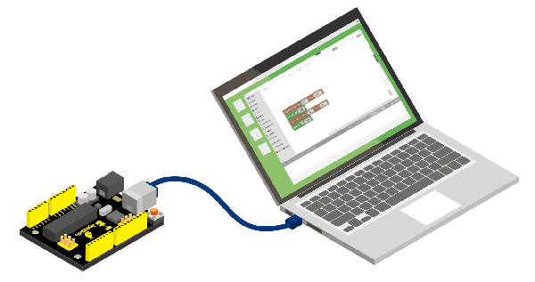

**Test Code**

Open Mixly blocks platform to get started with coding.   

First, click **IN/OUT**, drag the **“DigitalWrite PIN\# (0)Stat(HIGH)”** block. 

This block is used to set the level HIGH or LOW of Digital pin.    

Select HIGH is to set the HIGH level.

Select LOW is to set the LOW level.

The HIGH level is the state of high voltage, generally recorded as 1.

High voltage, high current, the LED lights. The LOW level is the state of low voltage, generally recorded as 0. Low voltage, low current, the LED Not lights.

To observe the LED blink obviously, we need to add a Delay block.

Check the test code below and upload it to your UNO R3 board.

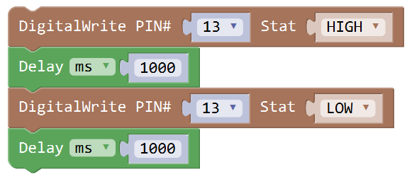

**Result**

Drag the test code to Mixly window; remember to select the proper board and COM port. Then compile and upload the code to your control board. Upload success message will appear on the bottom bar.

The UNO R3 built-in LED (label “L”) will turn on for 1 second, and then turn off for 1 second, alternately and circularly.

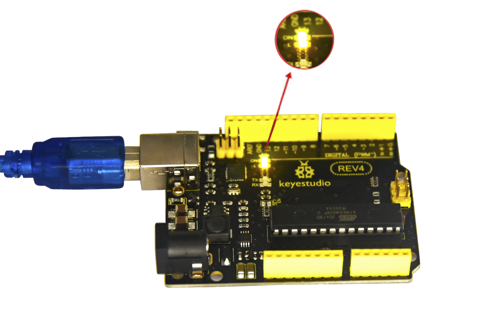

### Project 2: LED Blink

**Overview:**

LED blink is one of the most basic experiments in learning programming.

This project we use keyestudio white LED module. You will learn first how to blink an LED.

There are three lead-out pins on the module, respectively negative pin(marked -), positive pin(marked +) and signal pin(marked S).

Separately connect the white LED module to the pin G, 5V and D3 of keyestudio motor drive shield V2 using three F-F jumper wires. Then stack the motor drive shield V2 onto the UNO R3 control board.

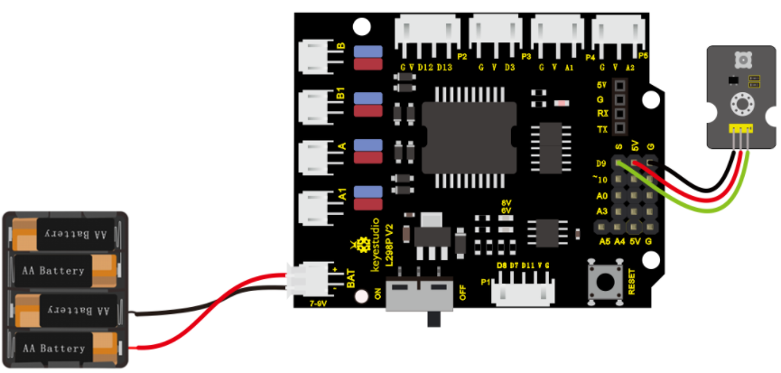

**Note:** stack the motor drive shield on the UNO R3 board; connect white LED module to motor drive shield (pin G for GND, V for 5V, S for digital pin3 (S)).

Connect the power to BAT connector.

Done wiring, upload the test code to the board, so as to turn on an LED light.

**Test Code:**

Now write the program to make the white LED flash.

Go to click library**“Desktop_Car_V3”**, drag out the block, this block is used to set the HIGH/LOW for digital port;

Click the drop-drown triangle icon to select HIGH for digital pin, with voltage; select LOW for digital pin, with no voltage.

So what should we set the white LED pin output HIGH or LOW to turn on the LED? Through testing, set to HIGH, white LED turns on; set to LOW, white LED turns off.

And go to**“Control”**, drag out the blockto add a delay time.

Duplicate this code string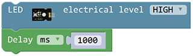once and change to LOW.

We turn on the white LED for one second then off for one second.

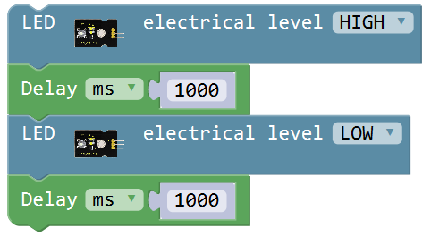

**Note:** uploading the test code, DO NOT connect the Bluetooth module to motor drive shield. Otherwise, code upload fails.

**Result:**

Done uploading the code, turn the slide switch ON.

You will see the LED module turn on for one second, then off for one second.

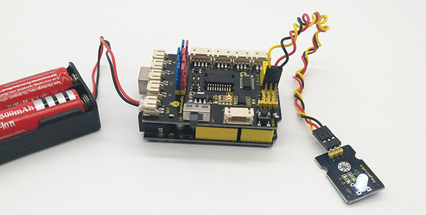

**Little Knowledge:**

1.  In the code, we’ve set the LED signal pin to D3 in the library; we can set the led signal pin without using library. The blockfrom library“Desktop_Car_V3”is used to set the HIGH/LOW for digital port; Click the drop-drown triangle icon to select HIGH for digital pin, with voltage;
    select LOW for digital pin, with no voltage.

Besides, To make the same effect, you can use the blockfrom “In/Out”. change the pin0 to pin3.

So you can see the same final effect using the blockor
.

1.  What happens when you change the number in one or both of the delay(1000)
    

This delay period is in milliseconds, so if you want the LED to blink as low or fast, change the value, try 500 or 2000.

**Extension Practice:**

Try making the LED blink without using library. Set the LED signal to D11, and turn on for 0.5 second; off for 0.2 second, alternately and circularly.

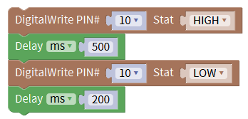

### Project 3: Obstacles Detection

**Overview:**

The robot car kit is packed with 2 infrared obstacle detector sensors.

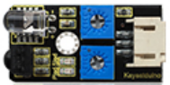

The infrared obstacle detector sensor is actually a distance-adjustable obstacle avoidance sensor designed for a wheeled robot.

It has a pair of infrared transmitting and receiving tubes. The transmitter emits an infrared rays of a certain frequency. When the detection direction encounters an obstacle (reflecting surface), the infrared rays are reflected back, and receiving tube will receive it. At this time, the indicator lights up. After processed by the circuit, the signal output terminal will output Digital signal.

You can rotate the potentiometer knob on the sensor to adjust the detection distance. The effective distance is 2-40cm and the working voltage is 3.3V-5V.

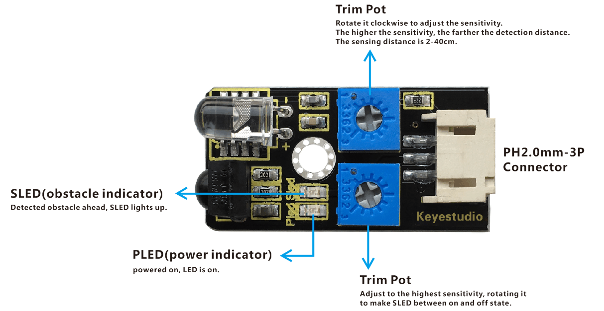

**TECH SPECS:**

-   Operating Voltage: DC 3.3-5V

-   Detection Distance: 2-40cm

-   Interface: 3PIN

-   Output Signal: Digital signal

In this project, we read the signal level of obstacle detector sensor to judge whether detect obstacles or not.

When detects an obstacle, sensor’s signal pin outputs LOW (display 0); otherwise, output HIGH (display 1).

Show the result on the serial monitor, and control the external LED module turn ON/OFF.

**Wiring Diagram:**

Connect two infrared obstacle detector modules and an LED module to keyestudio motor drive shield V2.

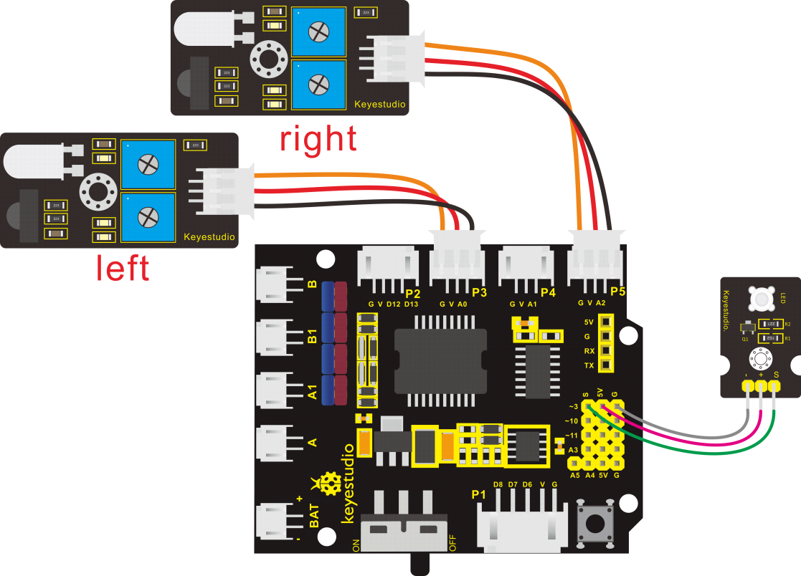

**Note:** stack the motor drive shield onto UNO R3 control board. connect the left obstacle detector sensor to P3（G、V、A0) connector on the motor drive shield; the right obstacle detector sensor to P5（G、V、A2) connector. If the digital ports are not enough, analog port can be used as digital port. Analog port A0 corresponds to digital port14; A1 corresponds to digital port15.

The white LED module is connected to motor drive shield; pin G for GND, V for 5V, S for digital pin3 (S). Connect the power to BAT connector.

**Test Code:**

We have connected well the both obstacle detector sensors, white LED module and power supply. Now write the program to test the left and the right obstacle detector sensor.

Go to **“Control”**, drag out the **“setup”** block; and drag the **“Serial baud rate(9600)”** block from **“SerialPort”** into the **“setup”** block.

To read the measured signal info by both obstacle detector sensors, we click the **“SerialPort”** , drag out the block
; drag out the blockfrom **“Text”** into the block, and then duplicate the complete block three times. Change the firstto “left_sensor”; drag out the block 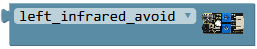from library**“Desktop_Car_V3”**to replace the second; delete the third hello box, forming a blank box; Change the fourthto “right_sensor”.

And again go to **“SerialPort”**, drag out the block; duplicate the blockonce and drag it into, click the drop-down triangle icon to select the “right_infrared_avoid”

And go to **“Control”**, drag the delay block; set the delay time in 500ms.

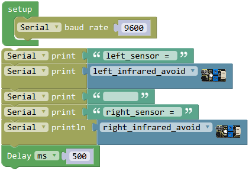

Upload the above code to see the effect. Powered on, the Pled LED on the obstacle detector sensor turns on. Through testing, if detected obstacle, obstacle detector sensor outputs LOW 0 and the built-in Sled LED turns on red; no obstacle, the sensor outputs HIGH 1 and the built-in Sled LED is off.

We’ve measured what signal the left and the right obstacle detector sensor send. Next the white LED module is turned on when any obstacle detector sensor detects an obstacle.

Next write the program that can turn on or off white LED module using the left and the right obstacle detector sensor.

Here we can use the condition statement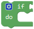or 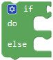. But the block is more efficient than
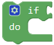.

Go to **“Control”**, drag out the block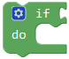, then click the blue gear icon, appear the edit box, drag the
 block intoblock. So you can get the block .

Next, go to the **“Logic”**, drag out the block, and drag out the block from the**“Desktop_Car_V3”**into the first input box at the left side of “**=**”; drag thefrom the **“Math”** into the second input box at the right side of “**=**” ; like this:.

We duplicate the block once and click the drop-down triangle icon to select the “right_infrared_avoid”. 

And again go to the **“Logic”**, drag out the blockbehind if statement; click the drop-down triangle icon to select “or”. then drag the blockand into the input box of block.

Click the**“Desktop_Car_V3”**, drag out the block into **do** statement, keep HIGH; duplicate the block once and set to **LOW** and drag it into **else** statement.


Now we have written the code and upload it to see the final result!


**Special note:**

You can turn the tirmpot on the obstacle detector sensor to adjust the inductive sensitivity.

Rotate the potentiometer near the infrared emitter to the end clockwise, then adjust the potentiometer near the infrared receiver to observe the Sled light, turn the Sled light off, and keep the critical point to be lit. The sensitivity
is the best.

**Result:**

Done wiring, connect the UNO R3 control board to computer’s USB port with USB cable to upload the code.

Code upload success, open the serial monitor, and set the baud rate to 9600. We can see the HIGH or LOW level of signal pin of left and right sensors. As shown below.

When any sensor detects obstacle (output 0), external LED module will turn on; otherwise, LED turns off.


**Little Knowledge:**

In the code, we use the library to read the HIGH/LOW
of the left infrared avoiding sensor (A0); using the block also makes sense.

The signal pin of the right infrared avoiding sensor is A2.

 means the baud rate is set to 9600;

 Print the specified number, text or other value on serial monitor.

 Print the specified number, text or other value on newline of monitor.

 means that if condition 1 is satisfied, it's going to be A, otherwise it's going to be B.

When using, you can find the **if...do...**statement block in the Mixly Control Block. Then click the gear icon on the block to drag out the **else** or **else if** block you need to use.


This is a logical statement. It’s available as long as can satisfy any one of the two conditions.


**Extension Practice:**

Change the test code without using the library, making the same function.


### Project 4: Playing Melody

**Overview:**

The keyestudio power amplifier module integrates an adjustable potentiometer, a passive buzzer speaker, an audio amplifier 8002B chip and 3pin header interface.

When testing, we can input square waves of different frequency at the signal pin to make passive buzzer speaker produce a sound.


We can turn the potentiometer to adjust the sound amplification, that is, to adjust the sound volume.

In this project, we will code the buzzer in power amplifier module to produce a tone. And if string a bunch of tones together, you’ve got music!

**Note:** stack the motor drive shield onto UNO R3 control board; connect the pin (G、V、S) of power amplifier module to the pin G, 5V, D11 of motor drive shield V2 with 3P female-to-female jumper wire. Connect the power supply to BAT connector.  


**Code:**

Write the program that can make the power amplifier module play a tone.

Click the**“Desktop_Car_V3”**, drag out the block，click the drop-down triangle icon behind frequency; you’ll see a series of pitch name in English letters and Numbers. You can choose different pitch name to set different frequency.

1(Do), 2(Re), 3(Mi), 4(Fa), 5(Sol), 6(La), 7(Si) are the roll-call in music. They correspond to NOTE C, NOTE D, NOTE E, NOTE F, NOTE G, NOTE A, NOTE B in the frequency drop-down list.

From 1（Do）to 7（Si）, that is from C to B. As the below table shown. The pitch/tone is getting higher and higher.

| 1(Do)  | 2(Re)  | 3(Mi)  | 4(Fa)  | 5(Sol) | 6(La)  | 7(Si)  |
|--------|--------|--------|--------|--------|--------|--------|
| NOTE_C | NOTE_D | NOTE_E | NOTE_F | NOTE_G | NOTE_A | NOTE_B |


Music requires tones as well as beats. The duration of each note, is the beat. We can use Delay block to set the beats. The larger the value, the longer the delay time is.

Click the drop-down triangle icon on the block to select the frequency **NOTE_A4**.

And go to **“Control”**, drag the delay block; set the delay time 200ms.

Click the imported library**“Desktop_Car_V3”**, drag out the block, and delay 200ms.

Copy the above string and change the last delay from 200 milliseconds to 1000 milliseconds. Upload the complete code to see what will happen.

**Code 1: play a tone**


**Code 2: do re mi fa so la si do**

We have introduced the knowledge of power amplifier module and tone play. Now write the program for the buzzer playing tune “do re mi fa so la si do”.

Click the**“Desktop_Car_V3”**, drag out the block，click the drop-down triangle icon to select the frequency **NOTE_C4**.

And go to **“Control”**, drag the delay block; set the delay time 300ms.

Duplicate the above code string seven times and click the drop-down triangle icon to separately select the frequency **NOTE_D4、NOTE_E4、NOTE_F4、NOTE_G4、NOTE_A4、NOTE_B4、NOTE_C5**. Keep the delay time 300ms.


Click the imported library**“Desktop_Car_V3”**, drag out the block, and duplicate a delay block once and set to 2000ms.

**Code 3: Ode to Joy**

How to use the power amplifier module to play a song of Ode to Joy? Next we write the program to make the buzzer play the song of Ode to Joy.

Click the**“Desktop_Car_V3”**, drag out the block，click the drop-down triangle icon to select the song **Ode_to_Joy**. Then drag out the blockto switch off the sound.

And go to **“Control”**, drag the delay block; set the delay time 3000ms.


**Result:**

Done wiring, connect the UNO R3 control board to computer’s USB port with USB cable to upload the code. Then turn the slide switch ON.

Upload code 1, buzzer will produce a tone of 440Hz for 0.2 second then off for 0.2 second, circularly.

Upload code 2, buzzer will play a tune “do re mi fa so la si do” circularly.

Upload code 3, buzzer will play a song Ode To Joy circularly.


Remember that you can turn the potentiometer to adjust the sound volume if can’t hear the tone.

  

**Little Knowledge:**

In the code 1, we use the library, the signal pin of passive buzzer module is connected to D11, with a frequency of 440Hz tone.

Note that you can click the Code on the Mixly window to check out the Arduino code.


1. In the code 1, , means the buzzer will make no tone.

2. In the code 2, we set the buzzer can play different tones of different frequencies.

3. In the code 3, means the buzzer will play a specific song. You can choose the tune Ode to Joy, or Birthday. 

   

**Extension Practice:**

For code 3, you can click to check out the corresponding language C; find out the tone of corresponding frequency and duration time, then refer to the code 2, try write into your own code.


**Tips:**

 set the frequency; set a period of time;The corresponding frequency of the first M3 is 658Hz; and the duration time is 300\*1=300ms. The rest is in the same manner.

### Project 5: Obstacles Alarm

**Overview:**

The ultrasonic module will emit the ultrasonic waves after trigger signal. When the ultrasonic waves encounter the object and are reflected back, the module outputs an echo signal, so it can determine the distance of object from the time difference between trigger signal and echo signal.


The ultrasonic module is commonly used in robot car DIY process. It can detect whether an obstacle ahead and we can measure the distance between ultrasonic sensor and obstacles by calculation.

When DIY smart car, we can use the measured distance data to program the robot car avoiding or following obstacles.

In this project, we are going to measure the distance between ultrasonic module and obstacles ahead, triggering the power amplifier module to make a sound.

When the measured distance between ultrasonic and obstacles ahead is less than 10cm, the speaker will produce a tone of 440Hz; otherwise, not sound.


**TECH SPECS:**

-   Operating Voltage: DC 5V

-   Operating Current: 15mA

-   Operating Frequency: 40khz

-   Maximum Range: 2-3m

-   Minimum Range: 2m

-   Sensing Angle: 15 degrees

-   Trigger Input Signal: 10µS TTL pulse

**Wiring Diagram:**


**Test Code:**

The ultrasonic sensor is connected to P2 connector of motor drive shield , VCC pin to V, Trig pin to digital 13 (S), Echo pin to digital 12 (S), G pin to GND(G); Trig pin is to trigger signal and Echo pin is to receive echo signal.

Next need to write the program to get the specific distance measured by ultrasonic sensor.

Go to **“Control”**, drag out the **“setup”** block;

Drag out the blockfrom **“SerialPort”** into the **“setup”** block.

Go to the **“SerialPort”** again, drag out the blockand 

Go to **“Text”**, drag out the block into the block, and change the word “hello” to **“distance=”**.

Then go to**“Desktop_Car_V3”**, drag and drop the ultrasonic block into **“Serial printIn”** block. To make the value print slowly, we add a delay block. 

And again go to **“Control”**, drag the delay block; set the delay time in 500ms.

Upload the code success, open the serial monitor to check the distance between ultrasonic sensor and an obstacle.


In the following, try to realize another two distance situations:

When the measured distance between the ultrasonic sensor and front obstacles is smaller than 10cm, power amplifier module plays sound.

When the measured distance between the ultrasonic sensor and front obstacles is greater than 10cm, power amplifier module no sound.

To judge whether the distance is smaller than 10cm or greater than 10cm, here we can use the condition statementor . But the block is more efficient than.

Go to **“Control”**, drag out the block, then click the blue gear icon, appear the edit box, drag the
 block intoblock. So you can get the block.

Next, go to **“Logic”**, drag the blockinto the **if** statement, and drag out the blockfrom the**“Desktop_Car_V3”**into the first input box at the left side of “**=**”; drag thefrom the **“Math”** into the second input box at the right side of “**=**” ; change the“**=**” to“**＜**” , change the value 0 to 10; like this:.

Click the**“Desktop_Car_V3”**, drag out the blockinto the **do** statement，click the drop-down triangle icon to select the frequency **NOTE_A4**.

Then drag out the blockinto the **else** statement to switch off the sound.


Okay. Now we have written the complete code for ultrasonic sensor and power amplifier module. Upload the code.


**Result:**

Done wiring, connect the UNO R3 control board to computer’s USB port with USB cable to upload the code.


Code upload success, open the serial monitor, and set the baud rate to 9600. You can see the distance between
ultrasonic and obstacle ahead, with a unit of cm.

When the measured distance between ultrasonic and obstacles ahead is less than 10cm, the speaker will produce a tone of 440Hz; otherwise, not sound.

**Little Knowledge:**

1.  In the code, we use the to measure the distance between ultrasonic sensor and obstacle ahead, with a unit of cm.
2.   means the baud rate is set to 9600;  : print the distance value on the newline of monitor. But if you use the block , it will not print the value on the newline; just print on the monitor. The difference between them is whether need to make line wrap.
3.  In the code also call the **if...do...** statement Refer to the detailed use in the project 3 please.


**Extension Practice:**

You can reset the distance measured by ultrasonic sensor. Change the different distance value to make the buzzer play a tone of different frequency.

### Project 6: Motor Driving and Speed Control

**Overview:**


There are many ways to drive the motor. Our robot uses the most commonly used L298P solution.

L298P is an excellent high-power motor driver IC produced by STMicroelectronics. It can directly drive DC motors, two-phase and four-phase stepping motors. The driving current up to 2A, and output terminal of motor adopts eight high-speed Schottky diodes as protection.

We have designed the motor driver shield V2 based on the L298P circuit.

The stackable design can make it be plugged directly into the Arduino, reducing the technical difficulty of using and driving the motor.

Direct stack the motor driver shield onto UNO R3 board, after the BAT is powered on, turn the Slide button ON, to supply the power for both keyestudio motor driver shield V2 and UNO R3 board.

For simple wiring, the motor driver shield comes with anti-reverse interfaces.
When connecting the motor, power supply and sensor modules, you just need to plug in directly.

The Bluetooth interface on the motor driver shield is fully compatible with keyestudio HM-10 Bluetooth module. When connecting, just plug HM-10 Bluetooth module into the corresponding interface.

At the same time, the motor drive shield has brought out extra digital and analog ports in 2.54mm pin headers, so that you can continue to add other sensors for experiments extension.

The motor drive shield can access to 4 DC motors, defaulted by jumper connection. The motor connector A and A1, connector B and B1 are separately in parallel.

The 8 jumpers can be applied to control the turning direction of 4 motors.

For instance, if change the 2 jumpers near the motor A connector from horizontal connection to vertical connection, the turning direction of motor A is opposite to the original rotation direction.


**Specifications:**

1.  Logic part input voltage: DC5V

2.  Driving part input voltage (limit): DC 6-18V

3.  Driving part input voltage (recommended): DC 7-12V

4.  Logic part working current: \<36mA

5.  Driving part working current: \<2A

6.  Maximum power dissipation: 25W (T=75℃)

7.  Working temperature: -25℃～＋130℃

**PINOUT Instructions:**


**Wiring Diagram:**

Connect two motors to keyestudio motor drive shield V2; stack the motor drive shield onto UNO R3 control board.


**Driving Motor**

According to the wiring diagram, default the jumper connection method.

Follow the table below to drive the 2 motors rotate by Digital, PWM pins, so as to control the robot car run.

The PWM value is in the range of 0-255. The greater the value set, the faster the motors rotate.

|                 | **D4** | **D5(PWM）** | **Motor B(left）** | **D2** | **D9(PWM）** | **Motor A(right）** |
|-----------------|--------|--------------|--------------------|--------|--------------|---------------------|
| Go forward      | HIGH   | 100          | Turn forward       | HIGH   | 100          | Turn forward        |
| Go backward     | LOW    | 100          | Turn backward      | LOW    | 100          | Turn backward       |
| Rotate to left  | LOW    | 100          | Turn backward      | HIGH   | 100          | Turn forward        |
| Rotate to right | HIGH   | 100          | Turn forward       | LOW    | 100          | Turn backward       |
| stop            | /      | 0            | stop               | /      | 0            | stop                |

Test Code: 

(without library)

Navigate the desktop Bluetooth car to turn forward for 2 seconds, backward for 2 seconds, and then rotate to left for 2 seconds, rotate to right for 2 seconds, stop for 2 seconds.

We go to write the code for motor A, B to turn front. Go to **“In/Out”**, drag out the blockand; separately duplicate these two blocks, set to digital pin 4 and pin 2, change the analog pin 3 to digital pin 5 and 9. Pin 4 and pin 2 set to HIGH; pin 5 and pin 9 are PWM pin. The greater the PWM value, the faster the speed is. So here we assign both value to 100.

Next go to drag out the blockfrom **“Control”**, and set to **2000ms**.


So now we complete the code for robot moving front for 2 seconds.

Let’s move on to write the code for robot turning back, rotating to left, rotating to right and stop.

Duplicate the finished code string three times;

Set the pin 4 and pin 2 to LOW, assign both pin 5 and pin 9 to 100, so that the motor A, B will turn backward, thus the robot will turn back.


Set the pin 4 to LOW and pin 2 to HIGH, assign both pin 5 and pin 9 to 100, so that the motor A turns back and motor B turns front, thus the robot will rotate to left.


Set the pin 4 to HIGH and pin 2 to LOW, assign both pin 5 and pin 9 to 100, so that the motor A turns front and motor B turns back, thus the robot will rotate to right.


Go to **“In/Out”** again, drag out the blockand duplicate once, change the pin3 to pin 5 and pin 9, assign the value 0; then add a delay block 2000ms.


Upload the complete code to see the desktop robot move.

**Result:**

Done wiring, connect the UNO R3 control board to computer’s USB port with USB cable to upload the code.


Upload success, turn the Slide switch ON. The 2 motors act like the smart car to turn forward for 2 seconds, backward for 2 seconds, rotate to left for 2 seconds, rotate to right for 2 seconds, stop for 2 seconds, alternately and circularly.


**Little Knowledge:**

1.  The code logic is completely based on the motor driving reference table. Check it out.
    
2.  The PWM value is in the range of 0-255. The greater the value set, the faster the motors rotate. Base on that, you can set the speed as you like.

**Extension Practice:**

Based on the logic table, try to reset a new moving track for your smart car.

Reference code:


### Project 7: Library Driving Motor

**Overview:**

There are many ways to drive the motor. We have learned how to control the 2 motors in the previous section, so as to drive the smart car run. It is troublesome to control the smart car via control port. For this, we specially create the library to drive the robot car more simple and easier.

When setting, the PWM value is in the range of 0-255. The greater the value settings, the faster the motors rotate.

**Wiring Diagram:**

**

**Test Code: (with library)**

Click the**“Desktop_Car_V3”**, drag out the block and set to PWM100; so the robot will move front at a speed of PWM100.

This blockhas the same function as the string block .

Next go to drag out the block from **“Control”**, and set to 2000ms.

How to write the code for robot back and stop?

Click the**“Desktop_Car_V3”**, drag out the blockand , set to PWM100; respectively add a delay block in 2000ms.

Continue to write the program for robot, rotate to left for 2 seconds, rotate to right for 2 seconds, turn left for 2 seconds, turn right for 2 seconds, stop for 2 seconds.

Drag out the block, , , and ; set to PWM100 and respectively add a delay block, set to delay 2000ms.


**Result:**

Done wiring, connect the UNO R3 control board to computer’s USB port with USB cable to upload the code.

Upload success, turn the Slide switch ON. The 2 motors act like smart car to turn forward for 2 seconds, backward for 2 seconds, stop for 2 seconds, rotate to left for 2 seconds, rotate to right for 2 seconds, turn left for 2 seconds, turn right for 2 seconds, stop for 2 seconds, circularly.


**Little Knowledge:**

1.  The code using library to set the car’s motion state, easy and simple, shortening the code length.
    
2.  The control logic is the same as project 6-motor driving. We can click to check out the corresponding language C of motor mixly code.


**Extension Practice:**

Based on the logic table, try to reset anew moving track for your smart car.(Reference program)

### Project 8: Line Tracking Sensor

**Overview:**

The tracking sensor is actually an infrared sensor. The component used here is the TCRT5000 infrared tube. Its working principle is to use the different reflectivity of infrared light to the color, then convert the strength of the reflected signal into a current signal.


During the process of detection, black is active at HIGH level, but white is active at LOW. The detection height is 0-3 cm.

For keyestudio 3-channel line tracking module, we have integrated 3 sets of TCRT5000 infrared tube on a single board. It is more convenient for wiring and control.

By rotating the adjustable potentiometer on the sensor, it can adjust the detection sensitivity of the sensor.

Special note: before testing, turn the potentiometer on the sensor to adjust the detection sensitivity. When adjust the LED front the trimpot at the threshold between ON and OFF, the sensitivity is the best.

**TECH SPECS:**

-   Operating Voltage: 3.3-5V (DC)

-   Interface: 5PIN

-   Output Signal: Digital signal

-   Detection Height: 0-3 cm


**Wiring Diagram:**

Next let’s do a simple test for this tracking module. The connection diagram is shown as below.


**Note:** stack the motor drive shield onto UNO R3 control board. connect the line tracking sensor to motor drive shield’s P1 connector (G, V, D6, D7, D8);

Connect the pin (G、V、S) of white LED module to the pin G, 5V, D3(S) of motor drive shield with 3P female-to-female jumper wire. Connect the power supply to BAT connector.

**Test Code:**

Now write the program to test the line tracking sensor.

Go to **“Control”**, drag out the **“setup”** block; and drag the **“Serial baud rate(9600)”** block from **“SerialPort”** into the **“setup”** block.

To respectively read the left, the center and the right tracking sensor on the line tracking module, we click the **“SerialPort”** , drag out the block; drag out the blockfrom **“Text”** into the block, and then duplicate the complete block six times. Change the firstto “left_tracking=”; drag out the blockfrom library**“Desktop_Car_V3”**to replace the second; delete the third hello box, forming a blank box; change the fourthto “center_tracking=”.

Duplicate the blockonce to replace the fifth and click the drop-down triangle icon to select the “center_tracking”; delete the sixth hello box, forming a blank box; change the seventh to “right_tracking=”.

And again go to **“SerialPort”**, drag out the block; duplicate the blockonce and drag it into, click the drop-down triangle icon to select the “right_tracking”

And go to **“Control”**, drag the delay block; set to delay 1000ms.


Complete and upload the above code to see the result. It can tell black and white.

Through testing, if line tracking sensor detects white, output LOW 0 and the built-in LED turns on red; detecting black, output HIGH 1 and the built-in LED is off.

We’ve measured what signal the line tracking sensor sends. Next the white LED is turned on when any tracking sensor detects white.

Next write the program that can turn on or off white LED module using line tracking sensor.

To judge whether the left, the center and the right tracking sensor detect black or white, here we can use the condition statementor . But the block is more efficient than.

Go to **“Control”**, drag out the block, then click the blue gear icon, appear the edit box, drag the  block intoblock. So you can get the block . 

Next, go to the **“Logic”**, drag out the block, and drag out the blockfrom the **“Desktop_Car_V3”**into the first input box at the left side of “**=**”; drag thefrom the **“Math”** into the second input box at the right side of “**=**” ; like this:.

We duplicate the block twice, and respectively click the drop-down triangle icon to select “center_tracking” and “right_tracking”.


And again go to the **“Logic”**, drag out the blockand click the drop-down triangle to select “or”; duplicate the blockonce and make as; drag this block behind into the **if** statement.

Now respectively drag the block,and into the input box of block.

Click the**“Desktop_Car_V3”**, drag out the block into **do** statement, keep HIGH; duplicate the block once and set to **LOW** and drag it into **else** statement.


Now we have written the code of tracking sensor controlling white LED module. Upload the complete to see the final result!


**Result:**

Done wiring, connect the UNO R3 control board to computer’s USB port with USB cable to upload the code.

Upload success, turn the Slide switch ON.

When the left TCRT5000 infrared tube detects a white line, LED module lights; detecting a black line, LED turns off.

In a similar way, we use other 2-way TCRT5000 infrared tubes to detect the black-white line. Refer to the knowledge of project 7-motor driving, we can extend to make a line tracking robot.


**Little Knowledge:**

In the code, we use the library to read the HIGH/LOW of the left sensor (D6); using the blockalso makes sense.

The signal pin of the middle sensor is D7; the signal pin of the right sensor is D8.

 means that if condition 1 is satisfied, it's going to be A, otherwise it's going to be B.


When using, you can find the **if...do...**statement block in the Mixly Control Block. Then click the gear icon on the block to drag out the **else** or **else if** block you need to use.

**Extension Practice:**

Change the test code without using the library, making the same result. (reference program)


### Project 9: Infrared Receiver

**Overview:**

There is no doubt that infrared remote control is commonly seen in our daily life. It's hard to imagine our world without it. In reality, an infrared remote control can be used to control a wide range of home appliances such as
television, audio, video recorders and satellite signal receivers.

Well, in the following let’s get a better understanding of the infrared remote control.


Infrared remote control is composed of infrared transmitting and infrared receiving systems. That is, consist of an infrared remote control, an infrared receiver module and a microcontroller that can decode.


The 38K infrared carrier signal transmitted by an infrared remote controller is encoded by an encoding chip inside the remote controller. It is composed of a pilot code, user code, data code, and data inversion code. The time interval between pulses is used to distinguish whether it is a signal 0 or 1. (when the ratio of high level to low level is about 1:1, considered as signal 0.) And the encoding is just well composed of signal 0 and 1.

The user code of the same button on remote controller is unchanged. Using difference data distinguish the key pressed on the remote control. When press down a button on the remote control, it will send out an infrared carrier signal. And when infrared receiver receives that signal, its program will decode the carrier signal, and through different data codes, thus can judge which key is pressed.

The microcontroller is decoded by an received signal 0 or 1 to determine which key is pressed by the remote control.

As for an infrared receiver module, it is mainly composed of an infrared receiving head. This device integrates with reception, amplification and demodulation. Its internal IC has been demodulated, able to complete all the work from infrared reception to output TTL level signal compatible. It outputs Digital signal. Suitable for IR remote control and infrared data transmission.

The infrared receiver module has only three pins (Signal line, VCC, GND), very convenient to communicate with Arduino and other microcontrollers.

**Parameters of IR Receiver:**

1.  Operating Voltage: 3.3-5V（DC）

2.  Interface: 3PIN

3.  Output Signal: Digital signal

4.  Receiving Angle: 90 degrees
    
5.  Frequency: 38khz

6.  Receiving Distance: 18m

**Wiring Diagram:**


**Note:** connect the infrared receiver sensor to P4（G、V、A1) connector on the motor drive shield. If the digital ports are not enough, analog port can be used as digital port. Analog port A0 corresponds to digital port14; A1 corresponds to digital port15.

The white LED module is connected to motor drive shield; pin G for GND, V for 5V, S for digital pin3 (S). Connect the power to BAT connector.

**Test Code:**

Now write the program. When aligning at the IR receiver, press the key on the IR remote control, available to check the input signal change of IR receiver on the serial monitor.

Go to **“Control”**, drag out theblock; and drag theblock from **“SerialPort”** into the **“setup”** block.

Next, IR receiver will receive the infrared signal when press different keys on the IR remote control.

We first click the imported library**“Desktop_Car_V3”**, drag out the block; drag the block from **“SerialPort”** into the infrared receiver block just made.

Then go to **“Variables”**, drag out the block into the block.

So the infrared receiver can receive the infrared signal.


Upload this code, open the serial monitor; aimed at the infrared receiver sensor, press the key on the IR remote control, IR receiver will receive the infrared signal, and indicator turns on red. And you can see the key encoding on the serial monitor.


Next move on to realize the IR receiver controlling white LED with IR remote control.

Press the front keyon the IR remote control, white LED turns on; press the key, white LED turns off. So here we call the if statement from the **“Control”**. According to the measured result, we know the infrared encoding(string value) of front key is FF629D; the infrared encoding(string value) of key is FF02FD.

As the command key of IR remote control is hexadecimal code, the front must add 0x.

If **ir_rec=0xFF629D**, press the front keyon the IR remote control, white LED turns on.

Go to the **“Logic”**, drag out the block into the **if** statement, and drag out the blockfrom the **“Variables”** into the first input box at the left side of “**=**”; drag thefrom the **“Math”** into the second input box at the right side of “**=**” and type “0xFF629D” , like this:


Click the imported library**“Desktop_Car_V3”**, drag out the block into **do** statement, keep HIGH.


Duplicate the above code string once, change “0xFF629D” to “**0xFF02FD**” and set to **LOW**.

Okay, the complete program has been written well. Upload the code to see the infrared remote control effect!


**Result:**

Code upload success, open the serial monitor, and set the baud rate to 9600.

Press your remote control, aimed at the infrared receiver, to send the signal, and you will see the encoding of each button on the remote control.

Note if press the control button too long, easily appear unreadable code.

Press the front keyon the IR remote control, white LED turns on; press the key, white LED turns off.

Here we have listed out each button value of keyestudio remote control as follows.


**Little Knowledge:**

In the code, we direct use the library; the signal pin of IR receiver module is A1; the IR receiver receives an infrared signal and outputs 16-bit encoding, printing out on serial monitor (baud rate 9600).

We can test out the 16-bit encoding of each button on the infrared remote control by source code. Or you can see the button encoding chart shown above.

**Extension Practice:**

Driving the 2 motors’ turning direction and speed by infrared remote control. (refer to project 6/7- motor driving) Combine infrared receiver and motors driving knowledge to build an infrared remote control car. (reference program)


## Assembly Steps for Smart Car

Follow the assembly steps below to build your own robot.

Bottom motor parts

You should mount two motors on the Acrylic bottom board.


Prepare the components as follows:

-   M2 Nut \*4

-   White N20 motor holder \*2

-   12FN20 motor connector \*2

-   M2\*10MM round-head screw \*4

-   Acrylic bottom board \*1

First place four M2 Nuts inside the holes of white N20 motor holders.


**Note:** the Acrylic plate is marked with A, B for the two motors. Mount the motor A to label A on the Acrylic plate; motor B to Acrylic position B.

Then mount the white N20 holders onto the motors.


Fix these two 12FN20 motor connectors on the Acrylic bottom plate with four M2\*10MM round-head screws.

Tighten them with screwdriver.


Battery case You can choose the 18650 2-cell battery case or 4-cell AA battery case. Mount the battery case on the acrylic bottom board.

Here we install the 4-cell AA battery case for the smart car.


You should first get some parts below:

-   4-cell Battery case\*1

-   M3\*8MM flat-head screws \*2

-   M3 Nut \*2

Fix the battery case on the top of Acrylic board using two M3\*8MM flat-head screws and two M3 Nuts.

Tighten the screws with screwdriver and self-prepared wrench.

Tracking sensor and wheels

Assemble the line tracking sensor and connect the wire:

-   JST-PH2.0MM-2P 24AWG red-black wire 160mm \*2

-   JST-PH2.0MM-5P blue-green-yellow-red-black connector wire 15CM \*1

-   M3\*5+6MM single-pass copper pillars \*2
    
-   M3\*6MM round-head screws \*2

-   M3 Nut \*2

-   Wheel \*2

- Line tracking sensor \*1

  

Connect 2 pieces of JST-PH2.0MM-2P red-black wire 160mm to the 12FN20 motor connectors. Connect two wheels to the motor spin.


Insert two M3\*5+6MM single-pass copper pillars into the holes on the line tracking sensor, and tighten two M3 Nuts on the copper pillars. Shown below. Tighten the nuts and screws with a self-prepared wrench.


After that, mount the line tracking sensor on the Acrylic board with two M3\*6MM round-head screws. Tighten the nuts and screws with a screwdriver and self-prepared wrench.


Connect a JST-PH2.0MM-5P 24AWG blue-green-yellow-red-black connector wire 15CM to the connector of tracking sensor. Shown below.


Completed the above assembly, let's install the caster for this small car.

- W420 ball caster wheel \*1

-  M3\*6MM round-head screws \*6

- M3 Nut \*2

- M3\*8+6MM single-pass copper pillar \*2

- M3\*40MM dual-pass copper pillar \*4

  


Screw the W420 ball caster wheel on the Acrylic bottom board with two M3\*6MM round-head screws, two M3 Nuts, two M3\*8+6MM single-pass copper pillars. Tighten the screws with a screwdriver.


Screw four M3\*40MM dual-pass copper pillars on the 4 corner holes on acrylic bottom board with four M3\*6MM round-head screws. Tighten the screws with a screwdriver.


**Ultrasonic module**

Now should install the particular eyes for this smart car, i.e. Ultrasonic module.

- Ultrasonic module \*1

- M3\*10MM round-head screw \*4

- M3 Nut \*4

- Ultrasonic acrylic board \*1

- JST-PH2.0MM-4P connector wire 8CM \*1

  

Look at the figure below, fix the ultrasonic module on the acrylic board with four M3\*10MM round-head screws and four M3 Nuts. Then connect the JST-PH2.0MM-4P connector wire to ultrasonic module.


**Acrylic top board**

Fix other sensors on the Acrylic top board. Prepare parts as follows:


-   Acrylic top board \*1

-   Obstacle detector sensor \*2

-   IR receiver sensor \*1

-   Keyestudio power amplifier module \*1

-   M3\*10MM round-head screw \*4

-   M3 Nut \*8

-   M3\*8+6MM single-pass copper pillar\*4

-   JST-PH2.0MM-3P yellow-red-black wire 8CM \*3

-   3pin F-F jumper wire \*1

Tighten four M3\*8+6MM single-pass copper pillars on the acrylic top board with four M3 Nuts using a wrench.


Separately mount two obstacle detector sensors and an IR receiver sensor on Acrylic top plate with three M3\*10MM screws and three M3 Nuts. Tighten them with a screwdriver and a self-prepared wrench.


Mount keyestudio power amplifier module on Acrylic top plate with a M3\*10MM screw and a M3 Nut. Tighten them with a screwdriver and a self-prepared wrench.


Connect the wire to the keyestudio power amplifier module, obstacle detector sensors and an IR receiver sensor.


**Complete Car**

Till now, the smart car is almost installed well. Assemble all the finished parts and install the control board as follows:

-   UNO R3 main board \*1

-   Motor drive shield \*1

-   Bluetooth module\*1

-   Jumpers cap \*8

-   M3\*6MM round-head screw \*8


Firstly, insert the ultrasonic module into the two holes of Acrylic bottom board. Then, screw the Acrylic top board to the copper pillars mounted on Acrylic bottom plate with four M3\*6MM round-head screws.  


After that, mount the UNO R3 main board onto the Acrylic top board with four M3\*6MM round-head screws using a screwdriver. And stack the motor drive shield onto UNO R3 board.


Finally insert the 8 jumpers and HM-10 Bluetooth module into the motor drive shield. (8 jumpers direction are by default; changing the jumper direction will change the motor turning direction)


Up to now, you have finished the hardware installation of the smart car Congrats!

For wiring, you can connect all the wires according to the corresponding silk-screen on the board.

**Connection diagram:**


## Smart Car Projects

### Project 10: Following Robot

**Circuit Design:**

In the above sections we already introduced the motor drive shield, sensor, module, motors and other elements.

According to the project 3/5/7 -- obstacle detection, obstacle alarm, and library driving motor,

we’re now ready to give the robot capability - Object Following!

In the project, we make the robot measure whether exist obstacles at both sides with obstacle detector sensors. Measure the distance between obstacle and robot, and then use the measured data to rotate the two motors, so as to control the robot car run.

**Below is a specific logic table of following robot for your reference:**


**Wiring:**

Based on the designed circuit, we are going to build a following robot car. Check the circuit diagram and test code.

****

**Note:** stack the motor drive shield onto UNO R3 control board. connect the ultrasonic sensor to motor drive shield’s P2 connector with 4P jumper wire, VCC pin to V, Trig pin to digital 13 (S), Echo pin to digital 12 (S), G pin to GND(G);

Connect the left obstacle detector sensor to the P3（G、V、A0) connector on the motor drive shield; the right obstacle detector sensor to P5（G、V、A2) connector with 3P jumper wire;

Connect the motor A and motor B to connector A and B separately. Connect the power supply to BAT connector.

**Test Code:**

Now write the program to achieve the function of following robot.

First we set up three variables, “**distance**”, “**val_L**”and “**val_R**”. The variable “distance” means save the distance value measured by ultrasonic sensor; “val_L”and “val_R” respectively save the signal of obstacle detected by the left and the right obstacle detector sensor.

Click **“Variables”**, drag out the block; and drag the blockfrom **“Math”** into the block. Then duplicate the blocktwice; respectively change “item” into “distance”, “val_L” and “val_R”; set the value to 0.


A variable is like a box, and a new variable is like making a box; we can give the box a name, like we just called it “distance”. The things placed inside the box can be changed, like we can place oranges, apples, pears, etc.

The function of the variable box in this program is to load the distance digit. With this box called “distance”, we can store the measured distance digit between ultrasonic sensor and front obstacle. So every time I mention distance, it refers to the distance value measured by the ultrasonic sensor at that time.

Click **“Variables”**, drag out the blockand; and drag the blockfrom**“Desktop_Car_V3”** into the block. And again go to drag the blockinto the block; then duplicate this code string once, change“val_L”to“val_R”, click the drop-down triangle to select “right_infrared_avoid”.


Next judge whether the ultrasonic sensor detects front obstacle or the left and the right obstacle detector module detects obstacle.

Here we can use the judgement statement **“if...do...else if...do...”** . First write the program when the center obstacle distance detected by ultrasonic sensor is smaller than or equal to 5cm, or both the left and the right obstacle detector module detect obstacle, the robot will turn back at a speed of PWM200.

Go to **“Control”**, drag out the block, then click the blue gear icon, appear the edit box, drag the  block intoblock five times. So you can get the block:


Next, go to **“Logic”**, drag the blockand select**“≤”**; go to **“Variables”**, drag out the block into the first input box at the left side of “**≤**”; drag thefrom the **“Math”** into the second input box at the right side of “**≤**” ; change the value 0 to 5; like this:(note you can type the value flexibly)

We duplicate this block twice, respectively change the variable“distance”to“val_L”and“val_R”;“≤”to“＝”

We have mentioned before that the obstacle detector module detects obstacle, output LOW digital signal 0; detects no obstacle, output HIGH digital signal 1. 

So here change the value 5 to 0:  

Think back, we use the two words “or”, “and ” when describe the judgement statement. There are two blocks in **“Logic”** to represent either one of two conditions happens or both of them happen at the same time, that is, .

Drag out the block and click the drop-down triangle to select “or” and can get the block.

Drag the block into block to make as.

Then drag the blockinto the first input box of or block; drag the block and respectively into the input box of and block. 

So can get the block and drag it behind to the **if** statement. This means the judgment condition is when the centre obstacle distance detected by ultrasonic sensor is smaller than or equal to 5cm, or both the left and the right obstacle detector module detect obstacle.

Followed by drag out the blockfrom**“Desktop_Car_V3”**into the **do** statement; change the PWM0 into **PWM200**.

Thus, we now have written well the program when the front obstacle distance detected by ultrasonic sensor is smaller than or equal to 5cm, or both the left and the right obstacle detector module detect obstacle, the robot will turn back at a speed of PWM200.


We now move on to write the program. When the front obstacle distance detected by ultrasonic sensor is greater than 5cm, and the left obstacle detector module detects obstacle and the right one didn’t detect obstacle, the robot will rotate to left at a speed of PWM200.

Duplicate the blockonce and drag into the first **else if** statement; set to **distance＞5 and val_L=0 and val_R=1**

Drag out the blockfrom**“Desktop_Car_V3”**into the **do** statement; change the PWM0 into **PWM200**.

Next write the program that the front obstacle distance detected by ultrasonic sensor is greater than 5cm, and the left obstacle detector module didn’t detect obstacle and the right one detects obstacle, the robot will rotate to right at a speed of PWM200.

Duplicate the blockonce and drag into the second **else if** statement; set to **distance＞5 and val_L=1 and val_R=0**

Drag out the blockfrom**“Desktop_Car_V3”**into the **do** statement; change the PWM0 into **PWM200**.


Move on to write the program. When the front obstacle distance detected by ultrasonic sensor is greater than 5cm, and smaller than or equal to 15cm, and both obstacle detector modules didn’t detect obstacle, the robot will stop running.

Go to **“Logic”**, drag out the block; duplicate the blockonce and set to **“distance≤15”**; then separately drag the blockandinto the input box of block, like this:.

And again drag out the block, then drag the block into the first input box of block; duplicate the block once and drag it into the second input box of blockand change “val_R=0” into “val_R=1”.

Drag the blockinto the third **else if** statement. Drag out the blockfrom**“Desktop_Car_V3”**into the **do** statement.

Next it’s easy to write the program. When the front obstacle distance detected by ultrasonic sensor is greater than 15cm, and smaller than or equal to 35cm, and both obstacle detector modules didn’t detect obstacle, the robot will go front at a speed of PWM255.

Direct duplicate the block once and change to **distance＞15 and distance≤35**, and drag it into the fourth **else if** statement.

Drag out the blockfrom**“Desktop_Car_V3”**into the **do** statement, and set the value to 255.

Finally write the program. When the front obstacle distance detected by ultrasonic sensor is greater than 35cm, and both obstacle detector modules didn’t detect obstacle, the robot will stop running.

Duplicate the code blockonce and drag it into the fifth **else if** statement. Change to **distance＞35 and val_L=1 and val_R=1**

Drag out the blockfrom**“Desktop_Car_V3”**into the **do** statement.


Now the code for following robot is finished. Upload the complete code to operate your desktop robot!


**Result:**

Stack the motor drive shield onto UNO R3 board. Connect the UNO R3 control board to computer’s USB port with USB cable to upload the code.

Upload success and turn the slide switch to ON position.

The robot will follow the front object to move.

### Project 11: Obstacle Avoiding Robot

**Circuit Design:**

We’re now ready to give the robot another capability - Obstacle Avoiding!

It is pretty simple. Just keep the same components and connection method as following robot, but need to change the code.


**Below is a specific logic table of obstacle avoiding robot:**


**Wiring:**

Based on the designed circuit, we are going to build an obstacle avoiding robot car.

****

**Test Code:**

In the above section we have introduced how to use the ultrasonic sensor and obstacle detector module to make a following robot. Now let’s write the program to make the robot automatically avoid obstacles.

First we set up three variables, “**distance**”, “**val_L**”and “**val_R**”. The variable “distance” means save the distance value measured by ultrasonic sensor; “val_L”and “val_R” respectively save the signal of obstacle detected by the left and the right obstacle detector sensor.

Click **“Variables”**, drag out the block; and drag the blockfrom **“Math”** into the block. Then duplicate the blocktwice; respectively change “item” into “distance”, “val_L” and “val_R”; set the value to 0.


Click **“Variables”**, drag out the blockand ; and drag the blockfrom**“Desktop_Car_V3”** into the block. And again go to drag the blockinto the block; then duplicate this code string once, change“val_L”to“val_R”, click the drop-down triangle to select “right_infrared_avoid”.


Next judge whether the ultrasonic sensor detects front obstacle or the left and the right obstacle detector module detects obstacle. Here we can use the judgement statement **“if...do...else if...do...”** .

First write the program. No matter how far the front obstacle detected by ultrasonic sensor, as long as both the left and the right obstacle detector module detect obstacle, the robot will turn back for one second at a speed of PWM150, and then turn left for 0.5 second at a speed of PWM200.

Go to **“Control”**, drag out the block, then click the blue gear icon, appear the edit box, drag the  block intoblock four times. So you can get the block:


Next, go to **“Logic”**, drag the block; go to **“Variables”**, drag out the block into the first input box at the left side of “**=**”; drag thefrom the **“Math”** into the second input box at the right side of “**=**” ; keep the value 0; like this:.

We duplicate this block once, and change the variable to; like this:

And again go to **“Logic”**, drag the blockinto the **if** statement, then drag the block  and  into the input box of block.

Drag out the blockfrom**“Desktop_Car_V3”**into the **do** statement, and set the value to **PWM150**. And add a delay block in **1000ms**.

Then drag out the blockinto the **do** statement, and set the value to **PWM200**. And add a delay block in **500ms**.

Till now we have made a piece of code like below:


We now move on to write the program. No matter how far the front obstacle detected by ultrasonic sensor, the left obstacle detector module didn’t detect obstacle and the right one detects obstacle, the robot will rotate to left at a speed of PWM200; the left obstacle detector module detects obstacle and the right one didn’t detect obstacle, the robot will rotate to right at a speed of PWM200.

Duplicate the blockonce and drag into the first **else if** statement; set to **val_L=1 and val_R=0**.

Drag out the blockfrom**“Desktop_Car_V3”**into the **do** statement; change the PWM0 into **PWM200**.

Duplicate the blockonce again and drag into the second **else if** statement; set to **val_L=0 and val_R=1**

Drag out the blockfrom**“Desktop_Car_V3”** into the **do** statement; change the PWM0 into **PWM200**.


We continue to write the program. When the front obstacle distance detected by ultrasonic sensor is smaller than or equal to 10cm, and both obstacle detector modules didn’t detect obstacle, the robot will rotate to right at a speed of PWM200. When the front obstacle distance detected by ultrasonic sensor is greater than 10cm, and the left obstacle detector module detects obstacle and the right one didn’t detect obstacle, the robot will go front at a speed of PWM200.

go to **“Logic”**, drag the  blockand select**“≤”**; go to **“Variables”**, drag out the block into the first input box at the left side of “**≤**”; drag thefrom the **“Math”** into the second input box at the right side of “**≤**” ; change the value 0 to 10; like this: 

Drag out the block into the third **else if** statement; drag the blockinto the first input box of block; duplicate the blockonce and drag it into the second input box of block; set to **val_L=1 and val_R=1**

Drag out the blockfrom**“Desktop_Car_V3”**into the **do** statement; change the PWM0 into **PWM200**.

Then duplicate the blockonce and drag it into the fourth **else if** statement; change to **distance＞10**, and drag out the blockinto the **do** statement; change the PWM0 into **PWM200**.


**Source Code:**


Now the code for obstacle avoiding robot is finished. Upload the complete code to see the final effect!

Can’t connect the Bluetooth module when upload the code, otherwise, code upload fails. You should upload the code success, then plug in the Bluetooth module.

**Result:**

Upload success and turn the slide switch to ON position.

The robot can automatically avoid the front obstacle to run.

### Project 12: Line Tracking Robot

**Circuit Design:**

In the above sections we already introduced the motor drive shield, sensor, module, motors and other elements.

According to the project 7/8 -- library driving motor, line tracking sensor, we’re now ready to give the robot capability - Line Tracking!

In the project, we make the robot detect black line at the car bottom with line tracking sensor. Then control the 2 motors rotate by measured result, so as to drive the robot track black line.


**Below is a specific logic table of line tracking robot for your reference:**


**Wiring:**

Based on the designed circuit, we are going to build a line tracking robot car. Check the circuit diagram.


**Note:** stack the motor drive shield onto UNO R3 control board. connect the line tracking sensor to motor drive shield’s P1 connector (G, V, D6, D7, D8); respectively connect the motor A and B to connector A and B on the motor drive shield. Connect the power supply to BAT connector.

**Test Code:**

Now write the program to build a line tracking robot.

The line tracking sensor detects white, output LOW 0; detecting black, output HIGH 1.

To judge whether the left, the center and the right tracking sensor detect black line, if the center tracking sensor detects black line, the robot will go front at a speed of PWM200.

Here we can use the condition statementor . But the blockis more efficient than.

Go to **“Control”**, drag out the block, then click the blue gear icon, appear the edit box, drag the block intoblock. So you can get the block .

Next, go to the **“Logic”**, drag out the blockinto the **if** statement, and drag out the block from the**“Desktop_Car_V3”**into the first input box at the left side of “**=**” and click drop-down triangle to select “center tracking”; drag thefrom the **“Math”** into the second input box at the right side of “**=**” and change the value to 1 ; like this:


Drag out the blockfrom**“Desktop_Car_V3”**into the **do** statement, and set the value to PWM200.

Or else, in the case that the center tracking sensor detects white line, if the left tracking sensor detects black line and the right tracking sensor detects white line, the robot will rotate to left at a speed of PWM200; if the left tracking sensor detects white line and the right tracking sensor detects black line, the robot will rotate to right at a speed of PWM200.

Here we can use the condition statement **“if...do...else if...do...”**

Go to **“Control”**, drag out the block, then click the blue gear icon, appear the edit box, drag the block intoblock. So you can get the blockand then drag this block into the **else** statement of block: 

Next, go to the **“Logic”**, drag out the block, and drag out the blockfrom the **“Desktop_Car_V3”** into the first input box at the left side of “**=**”; drag thefrom the **“Math”** into the second input box at the right side of “**=**” and change the value to 1 ; like this:.

We duplicate the block once, and respectively click the drop-down triangle icon to select “right_tracking” and change the value to 0.

And again go to the **“Logic”**, drag out the block into the **if** statement; respectively drag the block
andinto the input box of block. Get the block: 

Drag out the blockfrom**“Desktop_Car_V3”**into the **do** statement, and set the value to **PWM200**.


Next duplicate the block once and drag it into **else if** statement; change to **“left_tracking=0 and right_tracking=1”**

Drag out the blockfrom**“Desktop_Car_V3”**into the **do** statement, and set the value to PWM200.

Till now we have made a piece of code like below:


In the case that the center tracking sensor detects white line, if the left tracking sensor detects white line and the right tracking sensor detects white line, the robot will stop running; if the left tracking sensor detects black line and the right tracking sensor detects black line, the robot will stop running.

Click the blue gear icon on the left upper corner of **if** statement, appear the edit box, drag theblock beneath **else if** block. So that the blockwill turn into.

Drag out the blockfrom**“Desktop_Car_V3”**into the **else** statement.

Now we’ve written well the program code for line tracking function. Upload the code to see the final effect!

**Note:** Can’t connect the Bluetooth module when upload the code, otherwise, code upload fails. You should upload the code success, then plug in the Bluetooth module.


**Result:**

Upload success and turn the slide switch to ON position.

The robot can automatically track black line.

### Project 13: IR Remote Control Robot

**Circuit Design:**

In the above sections we’ve already introduced the motor drive shield, sensor, module, motors and other elements.

According to the project 7/9 -- library driving motor, infrared receiver, we’re now ready to give the robot capability - IR Remote Control!

In the infrared receiver section, we have listed out each button encoding of remote control.

In this project code, we can set the button value to control the robot status.


**Below is a specific logic table of IR Remote Control robot for your reference:**

|                     **Key**                     | **Key value** | **Status**                        |
| :---------------------------------------------: | :-----------: | --------------------------------- |
|  |    FF629D     | Go forward（PWM set to 150）      |
|  |    FFA857     | Go backward（PWM set to 150）     |
|  |    FF22DD     | Turn left                         |
|  |    FFC23D     | Turn right                        |
|  |    FF02FD     | Stop                              |
|  |    FF30CF     | Rotate to left（PWM set to 100）  |
|  |    FF7A85     | Rotate to right（PWM set to 100） |
|  |    FF9867     | Go forward（PWM set to 255）      |
|  |    FF38C7     | Go backward（PWM set to 255）     |

**Wiring:**

Based on the designed circuit, we are going to build an IR remote control car.

Check the circuit diagram and test code below.


**Note:** Stack the motor drive shield onto UNO R3 board. Due to IR receiver sensor inputting the digital signal, connect the infrared receiver sensor to P4（G、V、A1) connector on the motor drive shield. Respectively connect the
motor A and B to the connector A and B on the motor drive shield. Connect the power to BAT connector.

**Code:**

Write the program to make an infrared remote control robot.

Go to **“Control”**, drag out theblock; and drag theblock from **“SerialPort”** into the **“setup”** block.

Next, to control the robot by infrared remote control, we first click the imported library**“Desktop_Car_V3”**, drag out the block; drag the block from **“SerialPort”** into the infrared receiver block just made.

Then go to **“Variables”**, drag out the block into the block.


Press the keys to navigate the robot how to run. Here we use the condition statement.

Go to **“Control”**, drag out theblock. According to the project 9, we have listed out the string value of each key on infrared remote control.

The front keyis FF629D; back key  is FFA857; left key is FF22DD; right key is FFC23D; is FF02FD; is FF30CF; is FF7A85; is FF9867;  is FF38C7.

As the command key of IR remote control is hexadecimal code, the front must add 0x.

If **ir_rec=0xFF629D**, press the keyon the IR remote control, the robot will go front at a speed of PWM150.

Go to the **“Logic”**, drag out the block into the **if** statement, and drag out the blockfrom the **“Variables”** into the first input box at the left side of “**=**”; drag thefrom the **“Math”** into the second input box at the right side of “**=**” and type “0xFF629D” , like this:

Click the imported library**“Desktop_Car_V3”**, drag out the block into **do** statement and change to **PWM150**.


If **ir_rec=0xFFA857**, press the keyon the IR remote control, the robot will go back at a speed of PWM150.

Duplicate the blockonce and change “0xFF629D” to “**0xFFA857**” and drag into the **if** statement. Click  the imported library**“Desktop_Car_V3”**, drag out the blockinto **do** statement and change to **PWM150**.


At the same way, if **ir_rec=0xFF22DD**, press the keyon the IR remote control, the robot will turn left.

If **ir_rec=0xFFC23D**, press the keyon the IR remote control, the robot will turn right.

If **ir_rec=0xFF02FD**, press the keyon the IR remote control, the robot will stop.

If **ir_rec=0xFF30CF**, press the keyon the IR remote control, the robot will rotate to left at a speed of PWM100.

If **ir_rec=0xFF7A85**, press the keyon the IR remote control, the robot will rotate to right at a speed of PWM100.

Duplicate the blockfive times and respectively change “0xFF629D” to “0xFF22DD”, “0xFFC23D”, “0xFF02FD”, “0xFF30CF”, “0xFF7A85”.

Click the**“Desktop_Car_V3”**, respectively drag out the block, , , andinto **do** statement and change  to **PWM100**.


If **ir_rec=0xFF9867**, press the keyon the IR remote control, the robot will go front at a speed of PWM255.

If **ir_rec=0xFF38C7**, press the keyon the IR remote control, the robot will turn back at a speed of PWM255.

Duplicate the blocktwice and respectively change “0xFF629D” to “0xFF9867”, “0xFF38C7”.

Click the**“Desktop_Car_V3”**, respectively drag out the block,  and change to **PWM250**.


**Test Code:**


**Result:**

Stack the motor drive shield onto UNO R3 board.

Connect the UNO R3 control board to computer’s USB port with USB cable to upload the code.

Upload success and turn the slide switch to ON position.

We can use infrared remote control to randomly give commands to robot car.

### Project 14: Bluetooth Controlled Robot

Introduction

We have built an infrared control smart car. In this project we are going to make a Bluetooth control smart car. Since it is a control smart car, there should be a control terminal and a controlled terminal.


In the course, we use the mobile phone as the console (host), and the HM-10 Bluetooth module (slave) connected to smart car as the controlled terminal.

When using, we need to install an APP on the phone, and connect the HM-10 Bluetooth module, then we use the buttons on the Bluetooth APP to control the smart car to achieve various motion states.

Bluetooth Remote Control:

Bluetooth technology is a wireless standard technology that enables short-distance data exchange between fixed devices, mobile devices, and building personal area networks (using UHF radio waves in the ISM band of 2.4 to 2.485
GHz).

The robot kit is equipped with the HM-10 Bluetooth module, which is a master-slave machine. When used as the Host, it can send commands to the slave actively; when used as the Slave, it can only receive commands from the host.

The HM-10 Bluetooth module supports the Bluetooth 4.0 protocol, which not only supports Android mobile, but also supports iOS system.

In the experiment, we default to use the HM-10 Bluetooth module as a Slave and the cellphone as a Host.

We install the Bluetooth APP on the mobile phone, connecting the Bluetooth module; finally use the Bluetooth APP to control the robot car move, or to control the working status of other sensor modules on the robot car.

We provide you with 2 types of mobile APP, for Android and iOS system.

In this project, tap the forward button of the Bluetooth APP to control the buzzer sound. When the Bluetooth APP is successfully connected to the Bluetooth module, press the forward button of the Bluetooth APP, and the buzzer makes a small "click,click,click"; release the button to turn off the buzzer.


**Parameters of HM-10 Bluetooth Module:**

-   Bluetooth protocol: Bluetooth Specification V4.0 BLE

-   No byte limit in serial port Transceiving

-   In open environment, realize 100m ultra-distance communication with iphone4s

-   USB protocol: USB V2.0

-   Working frequency: 2.4GHz ISM band

-   Modulation method: GFSK(Gaussian Frequency Shift Keying)

-   Transmission power: -23dbm, -6dbm, 0dbm, 6dbm, can be modified by AT
    command.

-   Sensitivity: ≤-84dBm at 0.1% BER

-   Transmission rate: Asynchronous: 6K bytes ; Synchronous: 6k Bytes

-   Security feature: Authentication and encryption

-   Supporting service: Central & Peripheral UUID FFE0, FFE1

-   Power consumption: Auto sleep mode, stand by current 400uA\~800uA, 8.5mA during transmission.
    
-   Power supply: 5V
    DC

-   Working temperature: -5 to +65 Centigrade

Using Bluetooth APP


**For Android system:**

Click the Desktop_Car compression package to direct install the Desktop_Car APP; installed well, appear the icon below on your mobile phone:


Download the Desktop_Car package from the link below:

<https://drive.google.com/open?id=1mP3dCQu76xa-C3BbaECfQH0c9AaUFJek>

Or you can download the keyestudio Desktop_Car APP direct from the Google Play:

**Note: Allow APP to access LOCATION, you could enable LOCATION in settings of your cellphone.**

Tap the Desktop_Car icon to enter the Bluetooth APP. As shown below.


Done uploading the code to UNO R3 board, connect the Bluetooth module, the LED on the Bluetooth module will flash.    Then tap the option CONNECT on the APP, searching the Bluetooth.

Click to connect the Bluetooth. HMSoft connected, Bluetooth LED will turn on automatically.


First read the character of each key on mobile APP via serial port and know the key function. Click the buttonon the APP, buzzer will make a sound “click, click”; release the button, buzzer will turn off.

**For iOS system:**


Open the APP store.

Click to search keyestudio, and you will see the keyes BT car.


Tap to open the keyes BT car.

To open Bluetooth, click the “Connect” on the upper left corner, searching and connecting Bluetooth.


Tap the Desktop_Car icon to enter the control interface of desktop car.


Click the music icon to open the music control interface.


**Wiring Diagram:**

****

**Note:** Stack the motor drive shield onto UNO R3 control board. Connect the pin (G、V、S) of power amplifier module to the pin G, 5V, D11(S) of motor drive shield with 3P jumper wire. Plug firmly the Bluetooth module (RXD、TXD、GND、VCC) into the motor drive shield (TX、RX、-（GND）、+（VCC）). Connect the power supply to BAT connector.

**Coding:**

Write the program to know what signal the Bluetooth module sends.

Go to **“Control”**, drag out theblock; and drag theblock from **“SerialPort”** into the **“setup”** block.

We first click the imported library**“Desktop_Car_V3”**, drag out the block; drag the blockfrom **“SerialPort”** into the BLE receiver block just made.

Then go to **“Variables”**, drag out the block into the block.


Upload the code success, connect Bluetooth module, open serial monitor and set the baud rate to 9600. Aimed at Bluetooth module, press the key on the mobile APP, and you can see the corresponding control character of key.


**Below we have listed each button on the Bluetooth APP and what each button features.**

|                       **APP Buttons**                        |  **Control character**   | **Functions**                                                |
| :----------------------------------------------------------: | :----------------------: | ------------------------------------------------------------ |
|  |                          | pair and connect HM-10 Bluetooth module                      |
|  |                          | enter Bluetooth control interface                            |
|  |                          | disconnect the Bluetooth                                     |
|  | Press: F Release: S | Press the button, robot goes front; release to stop forward  |
|  | Press: B Release: S | Press the button, robot goes back; release to stop backward  |
|  | Press: L Release: S | Press the button, robot turns left; release to stop          |
|  | Press: R Release: S | Press the button, robot turns right; release to stop         |
|  |     Click to send: W     | Click the button, robot always goes straight at the fastest speed |
|  |     Click to send: Z     | Click the button, robot always goes back at the fastest speed |
|  | Press: Q Release: S | Pressed, robot rotates to the left                           |
|  | Press: E Release: S | Pressed, robot rotates to the right                          |
|  |     Click to send: S     | Stop all the functions                                       |
|  |           ---            | Click to start the mobile direction sensing control; click again to exit the function |
|  |     Click to send: Y     | Start the obstacle avoiding function; click Stop to exit the function |
|  |           ---            | Hold the button,and speak to cellphone: Go, car will move forward;  release and hold button again to speak: Stop, car will stop;  And: back, go backward; left, turn left; right, turn right. |
|  |     Click to send: X     | Start the line tracking function; click Stop to exit         |
|  |     Click to send: U     | Start the ultrasonic follow function; click Stop to exit     |
|  |            -             | Click to enter the music control interface                   |

**Click the music icon to enter the music control interface; Music control buttons are as below:**

|                         **Buttons**                          |    **Control character**    | **Function**                                                 |
| :----------------------------------------------------------: | :-------------------------: | ------------------------------------------------------------ |
|  |  Press: 1 Release: S   | Press to play the tone DO; release to stop playing           |
|  |  Press: 2 Release: S   | Press to play the tone RE; release to stop playing           |
|  |  Press: 3 Release: S   | Press to play the tone MI; release to stop playing           |
|  |  Press: 4 Release: S   | Press to play the tone FA; release to stop playing           |
|  |  Press: 5 Release: S   | Press to play the tone SO; release to stop playing           |
|  |  Press: 6 Release: S   | Press to play the tone LA; release to stop playing           |
|  |  Press: 7 Release: S   | Press to play the tone SI; release to stop playing           |
|  |  Press: 8 Release: S   | Press to play the tone DO; release to stop playing           |
|  |  Press: P Release: S   | Press to play a song Happy Birthday; release to stop playing |
|  | return to the previous step |                                                              |

We have read the character of each key on mobile APP via serial port and know the key function.

Click the buttonon the APP, buzzer will make a sound “click, click”; release the button, buzzer will turn off.

Here we call the condition statement block.

Go to **“Control”**, drag out the block, then click the blue gear icon, appear the edit box, drag the block intoblock. So you can get the block .

Next, go to the **“Logic”**, drag out the blockinto the **if** statement, and drag out the blockfrom the **“Variables”** into the first input box at the left side of “**=**” ; drag thefrom the **“Text”** into the second input box at the right side of “**=**”. when press the button,mobile Bluetooth will send a character “F” to Bluetooth module, Bluetooth module will receive the character “F”, so we replace the “a” with “**F**”.

Click the**“Desktop_Car_V3”**, drag out the block，click the drop-down triangle icon to select the frequency **NOTE_A4**.

And go to **“Control”**, drag the delay block; set the delay time 200ms.

Click the**“Desktop_Car_V3”**again, drag out the block, and add a delay 200ms.

Duplicate this piece of code once and change the final delay time to 1000ms.


**Code:**


We’ve written the complete code. Next upload the code success, press and release the buttonon Bluetooth APP to see the final effect.

Pay close attention that can’t connect the Bluetooth module when upload the code, otherwise, code upload fails.

You should upload the code successfully and then plug in the Bluetooth module.

**Result:**

Stack the motor drive shield onto UNO R3 board. Done wiring, connect the UNO R3 control board to computer’s USB port with USB cable to upload the code.

Make sure you have installed the Bluetooth APP on mobile phone. Power on the motor drive shield, Bluetooth indicator flashes and then open mobile APP to connect the Bluetooth module.

Bluetooth connected, press the Up button on the Bluetooth APP, buzzer will make a sound “click, click” ; release the button, buzzer will switch off.

Build Bluetooth Control Robot:

We have read the character of each key on mobile APP via serial port and know the key function. And we already learn how to drive the buzzer speaker sound using the buttonon Bluetooth APP.

Based on that, we can extend several buttons to control the motor drive shield and other sensor modules on the robot car.

Now get ready to give the robot car an extra function --Bluetooth Remote Control!

Based on the designed circuit, we are going to build a Bluetooth remote control desktop car.

****

**Note:** Stack the motor drive shield onto UNO R3 control board. Plug firmly the Bluetooth module (RXD、TXD、GND、VCC) into the motor drive shield (TX、RX、-（GND）、+（VCC）). Connect the motor A and motor B to connector A and B separately. Connect the power supply to BAT connector.

**Coding:**

Write the program to realize the functions we want. Use the button、、、、、、、andon the Bluetooth APP to navigate the robot go front, back, turn left, turnright, stop, rotate to left, rotate to right, go front at the fastest speed, goback at the fastest speed.

Go to **“Control”**, drag outtheblock; and dragtheblock from **“SerialPort”** into the **“setup”** block.

We click the imported library**“Desktop_Car_V3”**, drag out the block; drag the blockfrom **“SerialPort”** into the BLE receiver block just made.

Then go to **“Variables”**, drag out the block into the block.


Press any direction button and stop button, the Bluetooth module will receive corresponding signal, and robot car will move and stop in the corresponding direction.

So here require to make “option” judgement; we will use the block from **“Control”**.

Drag out the block, then click the blue gear icon, appear the edit box, drag theblock intoblock, turning into.

When the value of the "expression" behind the **switch** block is equal to the value of the "constant expression" behind a case block, the statement following this **case** is executed.

After executing the statement following a **case**, the process control is transferred to the next case to continue execution.

Since the Bluetooth APP has several direction buttons, press the different direction buttons to make the robot move in the corresponding direction; press stop button, robot car will stop.

So here we set 9 case statements; click the blue gear icon, appear the edit box, drag theblock into  block eight times again.

Press the arrow buttons on the APP, robot car will move in the corresponding direction.

Go to the **“Variables”** , drag out the blockinto the **switch** statement. Press the button, robot car will go front at a speed of PWM150. Go to **“Text”** , drag the blockinto **case** statement.
Because press the buttonand mobile Bluetooth will send a character “F” to Bluetooth module, Bluetooth module will receive the character “F”, so we replace the “a” with “**F**”.

Drag the blockfrom the**“Desktop_Car_V3”**beneath the **case** statement and change the PWM0 to **PWM150**.


Press the button, mobile Bluetooth will send a character “B” to Bluetooth module, Bluetooth module receives the character “B”, robot car will go back at a speed of PWM150.

Go to **“Text”** , drag the blockinto **case** statement, replacing the “a” with “**B**”. Drag the block from the**“Desktop_Car_V3”**beneath the **case** statement and change the PWM0 to **PWM150**.

Press the button, mobile Bluetooth will send a character “L” to Bluetooth module, Bluetooth module receives the character “L”, robot car will turn left.

Go to **“Text”** , drag the blockinto **case** statement, replacing the “a” with “**L**”. Drag the block from the**“Desktop_Car_V3”**beneath the **case** statement.

Press the button, mobile Bluetooth will send a character “R” to Bluetooth module, Bluetooth module receives the character “R”, robot car will turn right.

Go to **“Text”** , drag the blockinto **case** statement, replacing the “a” with “**R**”. Drag the block from the**“Desktop_Car_V3”**beneath the **case** statement.

Press the button, mobile Bluetooth will send a character “S” to Bluetooth module, Bluetooth module receives the character “S”, robot car will STOP.

Go to **“Text”** , drag the blockinto **case** statement, replacing the “a” with “**S**”. Drag the block from the**“Desktop_Car_V3”**beneath the **case** statement.

Press the button, mobile Bluetooth will send a character “Q” to Bluetooth module, Bluetooth module receives the character “Q”, robot car will rotate to left.

Go to **“Text”** , drag the blockinto **case** statement, replacing the “a” with “**Q**”. Drag the block from the**“Desktop_Car_V3”**beneath the **case** statement and change the PWM0 to **PWM100**.

Press the button, mobile Bluetooth will send a character “E” to Bluetooth module, Bluetooth module receives the character “E”, robot car will rotate to right.

Go to **“Text”** , drag the blockinto **case** statement, replacing the “a” with “**E**”. Drag the block from the**“Desktop_Car_V3”**beneath the **case** statement and change the PWM0 to **PWM100**.

Press the button, mobile Bluetooth will send a character “W” to Bluetooth module, Bluetooth module receives the character “W”, robot car will go front at the fastest speed of PWM255.

Go to **“Text”** , drag the blockinto **case** statement, replacing the “a” with “**W**”. Drag the block from the**“Desktop_Car_V3”**beneath the **case** statement and change the PWM0 to **PWM255**.

Press the button, mobile Bluetooth will send a character “Z” to Bluetooth module, Bluetooth module receives the character “Z”, robot car will go back at the fastest speed of **PWM255**.


Go to **“Text”** , drag the blockinto **case** statement, replacing the “a” with “**Z**”. Drag the block from the**“Desktop_Car_V3”**beneath the **case** statement and change the PWM0 to **PWM255**.


We have completed the program to realize the functions we want. Use the button、、   、 、 、、、  and on the Bluetooth APP to navigate the robot go front, back, turn left, turn right, stop, rotate to left, rotate to right, go front at the fastest speed, go back at the fastest speed.

**Note:** Can’t connect the Bluetooth module when upload the code, otherwise, code upload fails. You should upload the code successfully, then plug in the Bluetooth module.

**Result:**

Stack the motor drive shield onto UNO R3 board. Connect the UNO R3 control board to computer’s USB port with USB cable to upload the code. Turn the slide switch ON.

Make sure you have installed the Bluetooth APP on mobile phone. Power on the motor drive shield, Bluetooth indicator flashes and then open mobile APP to connect the Bluetooth module.

Bluetooth connected, we can use Bluetooth APP to randomly navigate the desktop car.

Press , go forward; press, go backward; press, turn left; press, turn right; press, stop; press, rotate to the left; press , rotate to the right; press , move forward at the fastest speed;  press , turn around; press, start mobile direction sensing control, and tap again this button to exit the direction sensing control.  

### Project 15: Bluetooth Multi-function Robot

How to build a multi-function robot combined with all the functions we’ve learned? In this circuit, we use a complete code to program the smart car to navigate the world on its own. Pretty simple and easy to switch different functions.

**Connection**

Pay attention that can’t connect the Bluetooth module when upload the code, otherwise, code upload fails. You should upload the code successfully, then plug in the Bluetooth module.

****

**Note:** stack the motor drive shield onto UNO R3 control board; connect the line tracking sensor to motor drive shield’s P1 connector (G, V, D6, D7, D8); connect the ultrasonic sensor to motor drive shield’s P2 connector, VCC pin to
V, Trig pin to digital 13 (S), Echo pin to digital 12 (S), G pin to GND(G);

Connect the pin (G、V、S) of power amplifier module to the pin G, 5V, D11(S) of motor drive shield with 3P female-to-female jumper wire;

Connect the left obstacle detector sensor to P3（G、V、A0) connector on the motor drive shield; the right obstacle detector sensor to P5（G、V、A2) connector;

Connect the infrared receiver sensor to P4（G、V、A1) connector on the motor drive shield;

Plug firmly the Bluetooth module (RXD、TXD、GND、VCC) into the motor drive shield (TX、RX、-（GND）、+（VCC）). Connect the motor A and motor B to connector A and B separately. Connect the power supply to BAT connector.

**Coding:**

Go to **“Control”**, drag out theblock; and drag theblock from **“SerialPort”** into the **“setup”** block.

We click the imported library**“Desktop_Car_V3”**, drag out the block; drag the blockfrom **“SerialPort”** into the BLE receiver block just made.

Then go to **“Variables”**, drag out the block into the block.

Press any direction button and stop button, the Bluetooth module will receive corresponding signal, and robot car will move and stop in the corresponding direction.

So here require to make “option” judgement; we will use the block from **“Control”**.

Drag out the block, then click the blue gear icon, appear the edit box, drag theblock intoblock, turning into.

When the value of the "expression" behind the **switch** block is equal to the value of the "constant expression" behind a case block, the statement following this **case** is executed.

After executing the statement following a **case**, the process control is transferred to the next case to continue execution.

Since the Bluetooth APP has several direction buttons, stop button, and button for obstacle avoiding, line tracking, ultrasonic follow function, press the different direction buttons to make the robot move in the corresponding direction and start different functions.

So here we set 12 case statements; click the blue gear icon, appear the edit box, drag the block into  block eleven times again.

**Press the arrow buttons on the APP, robot car will move in the corresponding direction.**

Go to the **“Variables”** , drag out the blockinto the **switch** statement. Press the button, robot car will go front at a speed of PWM200. Go to **“Text”** , drag the blockinto **case** statement. Because press the buttonand mobile Bluetooth will send a character “F” to Bluetooth module, Bluetooth module will receive the character “F”, so we replace the “a” with “**F**”.

Drag the blockfrom the**“Desktop_Car_V3”**beneath the **case** statement and change the PWM0 to **PWM200**.

Press the button, mobile Bluetooth will send a character “B” to Bluetooth module, Bluetooth module receives the character “B”, robot car will go back at a speed of PWM200.

Go to **“Text”** , drag the blockinto **case** statement, replacing the “a” with “**B**”. Drag the block from the**“Desktop_Car_V3”**beneath the **case** statement and change the PWM0 to **PWM200**.

Press the button, mobile Bluetooth will send a character “L” to Bluetooth module, Bluetooth module receives the character “L”, robot car will turn left.

Go to **“Text”** , drag the blockinto **case** statement, replacing the “a” with “**L**”. Drag the block from the**“Desktop_Car_V3”**beneath the **case** statement.

Press the button, mobile Bluetooth will send a character “R” to Bluetooth module, Bluetooth module receives the character “R”, robot car will turn right.

Go to **“Text”** , drag the blockinto **case** statement, replacing the “a” with “**R**”. Drag the block from the**“Desktop_Car_V3”**beneath the **case** statement.

Press the button, mobile Bluetooth will send a character “S” to Bluetooth module, Bluetooth module receives the character “S”, robot car will STOP.

Go to **“Text”** , drag the blockinto **case** statement, replacing the “a” with “**S**”. Drag the block from the**“Desktop_Car_V3”**beneath the **case** statement. Because Bluetooth module receives a character “S”, buzzer in the power amplifier module will make a sound, so here we need to drag the block from**“Desktop_Car_V3”**to turn off buzzer.


Press the button, mobile Bluetooth will send a character “Q” to Bluetooth module, Bluetooth module receives the character “Q”, robot car will rotate to left.

Go to **“Text”** , drag the blockinto **case** statement,replacing the “a” with “**Q**”. Drag the block from the**“Desktop_Car_V3”**beneath the **case** statement and change the PWM0 to **PWM200**.

Press the button, mobile Bluetooth will send a character “E” to Bluetooth module, Bluetooth module receives the character “E”, robot car will rotate to right.

Go to **“Text”** , drag the blockinto **case** statement, replacing the “a” with “**E**”. Drag the block from the**“Desktop_Car_V3”**beneath the **case** statement and change the PWM0 to **PWM200**.

Press the button, mobile Bluetooth will send a character “W” to Bluetooth module, Bluetooth module receives the character “W”, robot car will go front at the fastest speed of PWM255.

Go to **“Text”** , drag the blockinto **case** statement, replacing the “a” with “**W**”. Drag the block from the**“Desktop_Car_V3”**beneath the **case** statement and change the PWM0 to **PWM255**.

Press the button, mobile Bluetooth will send a character “Z” to Bluetooth module, Bluetooth module receives the character “Z”, robot car will go back at the fastest speed of PWM255.

Go to **“Text”** , drag the blockinto **case** statement, replacing the “a” with “**Z**”.


Then write the program for robot backward. Go to **“Functions”**, we drag out the block and name it as. Go to**“Desktop_Car_V3”**, drag out the blockinto the blockand delay **200ms**; followed by drag out the and add a delay **700ms**; then duplicate the block once and change the PWM0 to **PWM255**.

And go to **“Variables”** , we drag out the block, and drag out the blockfrom **“Math”** into the block and assign the value 0.

In such way, the robot can move back once.


Again go to **“Functions”**, we drag out the blockinto the main program **case ‘Z’**

We have completed the program to realize the functions that use the、、   、 、 、、、 and  on the Bluetooth APP to navigate the robot go front, back, turn left, turn right, stop, rotate to left, rotate to right, go front at the fastest speed, go back at the fastest speed.


**Next write the program for ultrasonic follow, line tracking, obstacle avoiding function.**

Click the button, mobile Bluetooth will send a character “U” to Bluetooth module, Bluetooth module receives the character “U”, the robot car will start ultrasonic following function.

Go to **“Text”** , drag the blockinto **case** statement, replacing the “a” with “**U**”.

**Move on to write the code string for ultrasonic following.**

Go to **“Functions”**, we drag out the block and name it as.

**Here need to set up a variable.**

First go to **“Variables”**, drag out the block; then drag the blockfrom “Math” into value behind; replace “item” with “flag”, and default as an integer, assign the variable “flag” to 0.

Then drag this blockintoblock, so that set up a variable block.

Now go to **“Variables”**, drag out the blockinto the block and assign a value 0.

Go to **“Control”**, drag out the blockinto the block. Go to **“Logic”**, drag the block into the repeat while block. And drag the variable blockinto the first input box of block; drag a blockinto the second input box of blockand keep the digit 0.


**Followed by set up three variables, “distance”, “sensor_L”and “sensor_R”.**

The variable “distance” means save the distance value measured by ultrasonic sensor; “sensor_L”and “sensor_R” respectively save the distance value detected by the left and the right obstacle detector sensor.

Click **“Variables”**, drag out the block; and drag the blockfrom **“Math”** into the block. Then duplicate the blocktwice; respectively change “item” into “distance”, “sensor_L” and “sensor_R”; set the value to 0.


Click **“Variables”**, drag out the blockinto the do block; and drag the block from**“Desktop_Car_V3”**into the block.

And click **“Variables”**again, drag out the block, and go to drag the blockfrom **“Desktop_Car_V3”** into the block; then duplicate this code string once, change“sensor_L”to“sensor_R”, click the drop-down triangle to select“right_infrared_avoid”.


Next judge whether the ultrasonic sensor detects front obstacle or the left and the right obstacle detector module detects obstacle. Here we can use the judgement statement **“if...do...else if...do...”** .

When the front obstacle distance detected by ultrasonic sensor is smaller than or equal to 5cm, and both obstacle detector modules detect obstacle, the robot will go back at a speed of PWM200.

Go to **“Control”**, drag out the block, then click the blue gear icon, appear the edit box, drag the  block intoblock five times. So you can get the block:

Next, go to **“Logic”**, drag out the blockand change**“=”**into**“≤”**; go to **“Variables”**, drag out the block into the first input box at the left side of “**≤**”; drag thefrom the **“Math”** into the second input box at the right side of “**≤**” ; change the value 0 to 5; like this: (note the value 5 can be set flexibly).

We duplicate the distance block twice, and change the variable to,, and change the**“≤”**into**“=”**;

We have mentioned before that the obstacle detector module detects obstacle, output LOW digital signal 0; detects no obstacle, output HIGH digital signal 1.
So here change the value 5 to 0. like this: ,

Think back, we use the two words “or”, “and ” when describe the judgement statement. There are two blocks in **“Logic”** to represent either one of two conditions happens or both of them happen at the same time, that is, .

Drag out the block and click the drop-down triangle to select “or” and can get the block.

Drag the block into block to make as.

Then drag the blockinto the first input box of or block; drag the block andrespectively into the input box of and block.
So can get the block and drag it behind to the **if** statement.

This means the judgment condition is when the centre obstacle distance detected by ultrasonic sensor is smaller than or equal to 5cm, or both the left and the right obstacle detector module detect obstacle.

Followed by drag out the blockfrom**“Desktop_Car_V3”**into the **do** statement; change the PWM0 into **PWM200**.

Now we have finished the program. When the front obstacle distance detected by ultrasonic sensor is smaller than or equal to 5cm, and both obstacle detector modules detect obstacle, the robot will go back at a speed of PWM200.


We now move on to write the program. When the front obstacle distance detected by ultrasonic sensor is greater than 5cm, and the left obstacle detector module detects obstacle and the right one didn’t detect obstacle, the robot will rotate to left at a speed of PWM200.

Duplicate the blockonce and drag into the first **else if** statement; set to **distance＞5 and val_L=0 and val_R=1**


Drag out the blockfrom**“Desktop_Car_V3”**into the **do** statement; change the PWM0 into **PWM200**.

Next write the program that the front obstacle distance detected by ultrasonic sensor is greater than 5cm, and the left obstacle detector module didn’t detect obstacle and the right one detects obstacle, the robot will rotate to right at a speed of PWM200.

Duplicate the blockonce and drag into the second **else if** statement; set to **distance＞5 and val_L=1 and val_R=0**


Drag out the blockfrom**“Desktop_Car_V3”**into the **do** statement; change the PWM0 into **PWM200**.


Move on to write the program. When the front obstacle distance detected by ultrasonic sensor is greater than 5cm, and smaller than or equal to 15cm, and both obstacle detector modules didn’t detect obstacle, the robot will stop running.

Go to **“Logic”**, drag out the block; duplicate the blockonce and set to **“distance≤15”**; then separately drag the blockandinto the input box of block, like this:.

And again drag out the block, then drag the block into the first input box of block;
duplicate the block once and drag it into the second input box of
blockand change “val_R=0” into “val_R=1”.

Drag the blockinto the third **else if** statement. Drag out the blockfrom**“Desktop_Car_V3”**into the **do** statement.

Next it’s easy to write the program. When the front obstacle distance detected by ultrasonic sensor is greater than 15cm, and smaller than or equal to 35cm, and both obstacle detector modules didn’t detect obstacle, the robot will go front at a speed of PWM255.

Direct duplicate the block once and change to **distance＞15 and distance≤35**, and drag it into the fourth **else if** statement.

Drag out the blockfrom**“Desktop_Car_V3”**into the **do** statement, and set the value to 255.

Finally write the program. When the front obstacle distance detected by ultrasonic sensor is greater than 35cm, and both obstacle detector modules didn’t detect obstacle, the robot will stop running.

Duplicate the code blockonce and
drag it into the fifth **else if** statement. Change to **distance＞35 and val_L=1 and val_R=1**

Drag out the blockfrom**“Desktop_Car_V3”**into the **do** statement.


Click the button,the robot car will exit the ultrasonic follow function.

We drag out the blockinto the repeat while block .

Then go to **“Control”**, drag out the blockinto the block. And drag out the blockfrom **“Math”** into the **if** statement. Then drag the blockfrom the **“Variables”**  into the first input box of; drag the blockfrom the **“Text”** into the second input box ofand change the “a” into “S”.

Go to **“Variables”**，drag out the block into the **do** block; and drag out the blockfrom **“Math”** into the blockand change value 0 into 1.


Finally, go to **“Functions”**, we drag out the blockinto the main program **case ‘U’**


Now the program for following robot is finished！

**Move on to write the code string for line tracking function.**

Press the button, mobile Bluetooth will send a character “X” to Bluetooth module, Bluetooth module
receives the character “X”, robot car will go front at the fastest speed of PWM255.

Go to **“Text”** , drag the blockinto **case** statement, replacing the “a” with “**X**”.

Then write the program for robot line tracking. Go to **“Functions”**, we drag out the block and name it as.

Go to **“Variables”**, drag out the blockinto the block and assign a value 0.

Go to **“Control”**, drag out the blockinto the block. Go to **“Logic”**, drag the block into the repeat while block. And drag the variable blockinto the first input box of block; drag a blockinto the second input box of blockand keep the digit 0.


**Followed by set up three variables, “val_L”, “val_C” and “val_R” ;**

These three variables respectively save the obstacle signal measured by the left, middle and the right line tracking sensor.

Click **“Variables”**, drag out the block; and drag the blockfrom **“Math”** into the block. Then duplicate the blocktwice; respectively change “item” into “val_L”, “val_C” and “val_R”.


Click **“Variables”**, drag out the blockinto the do block; and drag the block from**“Desktop_Car_V3”**into the block, like this; then duplicate this code string twice, change“val_L”to“val_C” and “val_R”, click the drop-down triangle to select “center_tracking” and “right_tracking”.


The line tracking sensor detects white, output LOW 0; detecting black, output HIGH 1.

To judge whether the left, the center and the right tracking sensor detect black line, if the center tracking sensor detects black line, the robot will go front at a speed of PWM200.

Here we can use the condition statementor . But the blockis more efficient than .

Go to **“Control”**, drag out the blockinto theblock, then click the blue gear icon, appear the edit box, drag the block intoblock. So you can get the block .

Next, go to the **“Logic”**, drag out the blockinto the **if** statement, and drag out the blockfrom the **“Variables”** into the first input box at the left side of “**=**” ; drag thefrom the **“Math”** into the second input box at the right side of “**=**” and change the value to 1 ;

Drag out the blockfrom**“Desktop_Car_V3”**into the **do** statement, and set the value to PWM200.


Or else, in the case that the center tracking sensor detects white line, if the left tracking sensor detects black line and the right tracking sensor detects white line, the robot will rotate to left at a speed of PWM200; if the left tracking sensor detects white line and the right tracking sensor detects black line, the robot will rotate to right at a speed of PWM200.

Here we can use the condition statement **“if...do...else if...do...else”**

Go to **“Control”**, drag out the block, then click the blue gear icon, appear the edit box, drag the block intoblock then drag the beneath the block. So you can get the block; then drag this block beneath the else block.

Next, go to the **“Logic”**, drag out the block, and drag out the blockfrom the **“Variables”** into the first input box at the left side of “**=**” ; drag thefrom the **“Math”** into the second input box at the right side of “**=**” and change the value to 1 ; like this: 

We duplicate this blockonce, and change toand change the value to 0\. 

And again go to the **“Logic”**, drag out the block into the **if** statement; respectively drag the block  and into the input box of block.

Drag out the blockfrom**“Desktop_Car_V3”**into the **do** statement, and set the value to **PWM200**.

Next duplicate the blockonce and drag it into **else if** statement; change to **“val_L=0 and val_R=1”**

Drag out the blockfrom**“Desktop_Car_V3”**into the **do** statement, and set the value to **PWM200**.


In the case that the center tracking sensor detects white line, if the left tracking sensor detects white line and the right tracking sensor detects white line, the robot will stop running; if the left tracking sensor detects black line and the right tracking sensor detects black line, the robot will stop running.

Drag out the blockfrom**“Desktop_Car_V3”**into the **else** statement.

Click the button,the robot car will exit the line tracking function.

We drag out the blockinto the repeat while block .

Then go to **“Control”**, drag out the blockinto the block. And drag out the blockfrom **“Math”** into the
**if** statement. Then drag the blockfrom the **“Variables”**  into the first input box of; drag the blockfrom the **“Text”** into the second input box ofand change the “a” into “S”.

Go to **“Variables”**，drag out the block into the **do** block ; and drag out the blockfrom **“Math”** into the blockand change value 0 into 1.


Finally，go to **“Functions”**, we drag out the blockinto the main program **case ‘X’**


Now the program for line tracking robot is finished！ 

**Move on to write the code string for obstacle avoiding function.**

Press the button, mobile Bluetooth will send a character “Y” to Bluetooth module, Bluetooth module
receives the character “Y”, robot car will go front at the fastest speed of PWM255.

Go to **“Text”** , drag the blockinto **case** statement, replacing the “a” with “**Y**”.

Then write the program for robot avoiding obstacle. Go to **“Functions”**, we drag out the block and name it as.

Go to **“Variables”**, drag out the blockinto the block and assign a value 0.

Go to **“Control”**, drag out the blockinto the block. Go to **“Logic”**, drag the block into the repeat while block. And drag the variable blockinto the first input box of block; drag a blockinto the second input box of blockand keep the digit 0.


Click **“Variables”**, drag out the blockinto the block; and drag the block from**“Desktop_Car_V3”** into the block.

And again click **“Variables”**, drag out the block; go to drag the blockfrom **“Desktop_Car_V3”** into the block; then duplicate this code string once, change“sensor_L”to“sensor_R”, click the drop-down triangle to select“right_infrared_avoid”.


Next judge whether the ultrasonic sensor detects front obstacle or the left and the right obstacle detector module detects obstacle. Here we can use the judgement statement **“if...do...else if...do...”** .

First write the program. No matter how far the front obstacle detected by ultrasonic sensor, as long as both the left and the right obstacle detector module detect obstacle, the robot will turn back for one second at a speed of PWM150, and then turn left for 0.5 second at a speed of PWM200.

Go to **“Control”**, drag and drop the blockinto the **do** statement of block, then click the blue gear icon, appear the edit box, drag the  block intoblock four times. So you can get the block:

Next, go to **“Logic”**, drag the block; go to **“Variables”**, drag out the block into the first input box at the left side of “**=**”; drag thefrom the **“Math”** into the second input box at the right side of “**=**” ; change the value 0 to 5; like this:

We duplicate this block once, and change the variable to; like this:

And again go to **“Logic”**, drag the blockinto the **if** statement, then drag the blockand  into the input box of block.

Drag out the blockfrom**“Desktop_Car_V3”**into the **do** statement, and set the value to **PWM150**. And add a delay block in **1000ms**.

Then drag out the blockinto the **do** statement, and set the value to **PWM200**. And add a delay block in **500ms**.

Till now we have made a piece of code like below:


We now move on to write the program. No matter how far the front obstacle detected by ultrasonic sensor, the left obstacle detector module didn’t detect obstacle and the right one detects obstacle, the robot will rotate to left at a speed of PWM200; the left obstacle detector module detects obstacle and the right one didn’t detect obstacle, the robot will rotate to right at a speed of PWM200.

Duplicate the blockonce and drag into the first **else if** statement; set to **val_L=1 and val_R=0**

Drag out the blockfrom**“Desktop_Car_V3”**into the **do** statement; change the PWM0 into **PWM200**.

Duplicate the blockonce again and drag into the second **else if** statement; set to **val_L=0 and val_R=1**

Drag out the blockfrom**“Desktop_Car_V3”** into the **do** statement; change the PWM0 into **PWM200**.


We continue to write the program. When the front obstacle distance detected by ultrasonic sensor is smaller than or equal to 10cm, and both obstacle detector modules didn’t detect obstacle, the robot will rotate to right at a speed of PWM200. When the front obstacle distance detected by ultrasonic sensor is greater than 10cm, and the left obstacle detector module detects obstacle and the right one didn’t detect obstacle, the robot will go front at a speed of PWM200. 

Go to **“Logic”**, drag the blockand select**“≤”**; go to **“Variables”**, drag out the block into the first input box at the left side of “**≤**”; drag thefrom the **“Math”** into the second input box at the right side of “**≤**” ; change the value 0 to 10; like this:

Drag out the block into the third **else if** statement; drag the blockinto the first input box of block; duplicate the blockonce and drag it into the second input box of block; set to **val_L=1 and val_R=1**

Drag out the blockfrom**“Desktop_Car_V3”**into the **do** statement; change the PWM0 into **PWM200**.

Then duplicate the blockonce and drag it into the fourth **else if** statement; change to **distance＞10**, and drag out the blockinto the **do** statement; change the PWM0 into **PWM200**.


Click the button, the robot car will exit the line tracking function.

We drag out the blockinto the repeat while block .

Then go to **“Control”**, drag out the blockinto the block. And drag out the blockfrom **“Math”** into the **if** statement. Then drag the blockfrom the **“Variables”**  into the first input box of; drag the blockfrom the **“Text”** into the second input box ofand change the “a” into “S”.

Go to **“Variables”**，drag out the block into the **do** block ; and drag out the blockfrom **“Math”** into the blockand change value 0 into 1.


Finally, go to **“Functions”**, we drag out the blockinto the main program **case ‘Y’**

Now the program for obstacle avoiding robot is finished！


**Move on to make the buzzer in power amplifier module play a tune “do re mi fa so la si do” and then play a specific song.**

Press the buttonon the APP to enter the music interface; press the button,mobile Bluetooth will send a character “1” to Bluetooth module, Bluetooth module receives the character “1”, buzzer will play a tone of NOTE_C4.

For the main program, go to **“Text”** , drag the blockinto **case** statement, replacing the “a” with “**1**”.

Click the**“Desktop_Car_V3”**, drag out the block，click the drop-down triangle icon to select the frequency **NOTE_C4**.

Duplicate this piece of code seven times and click the drop-down triangle icon to separately select the frequency **NOTE_D4、NOTE_E4、NOTE_F4、NOTE_G4、NOTE_A4、NOTE_B4、NOTE_C5**.


Press the button,Bluetooth module sends the character “2”, buzzer will play a tone of NOTE_D4.

Press the button, Bluetooth module sends the character “3”, buzzer will play a tone of NOTE_E4.

Press the button,Bluetooth module sends the character “4”, buzzer will play a tone of NOTE_F4.

Press the button, Bluetooth module sends the character “5”, buzzer will play a tone of NOTE_G4.

Press the button,Bluetooth module sends the character “6”, buzzer will play a tone of NOTE_A4.

Press the button, Bluetooth module sends the character “7”, buzzer will play a tone of NOTE_B4.

Press the button, Bluetooth module sends the character “8”, buzzer will play a tone of NOTE_C5.

Press the button,Bluetooth module sends the character “P”, buzzer will play a song HAPPY BIRTHDAY.

Here we need to set up the variable“**mus**”to represent the number of buttonpressed.

Click **“Variables”**, drag out the block; and drag the blockfrom **“Math”** into the block. And change“item”into“**mus**”; set the value to 0.

Go to **“Control”**, we drag out the blockinto the main program **case ‘P’**

And drag out the blockfrom **“Math”** into the **while** statement. Then drag the blockfrom the **“Variables”**  into the first input box of block; drag the blockfrom the **“Math”** into the
second input box of block; change the “0” into “1” and change the“=”into **“＜”** .


Go to **“Desktop_Car_V3”**，drag out the block into the block ; click the drop-down triangle to select the birthday song; and drag out the block beneath the birthday block.

Then drag out the blockfrom the **“Variables”** beneath the block; drag out the blockfrom the **“Math”** into the block. And again drag and drop the blockinto the input box at the left side of“+”, replacing 1; the right side value 1 remains the same.

So can get this block  and drag this block beneath the No Tone block.


To make the number of buttonpressed return 0, we go to drag out the block into the main program **case ‘P’** and assign value 0.


Now we’ve written well the program code for multiple functions. Upload the code to see the final effect!


**Note:** Can’t connect the Bluetooth module when upload the code, otherwise, code upload fails. You should upload the code success, then plug in the Bluetooth module.

**Test Result**

Connect the UNO R3 control board to computer’s USB port with USB cable to upload the code. Turn the slide switch ON.

Connected Bluetooth module, we can use Bluetooth APP to navigate the desktop car by clicking the different buttons on the APP.

Tap Stop button to pause the function.

**Note:** the Android Bluetooth APP **CANNOT** realize the voice control.

## Resource Download

You can get more reference from below links:

KEYESTUDIO WIKI: <http://wiki.keyestudio.com/>

All the relevant info download from: <https://1drv.ms/u/s!ArhgRvK6-RyJcxRRe3SxqYE_X3I?e=fJHrQl>

Assembly Video Link: [http://video.keyestudio.com/ks0441/](http://www.keyestudio.com/wp/ks0313/)

